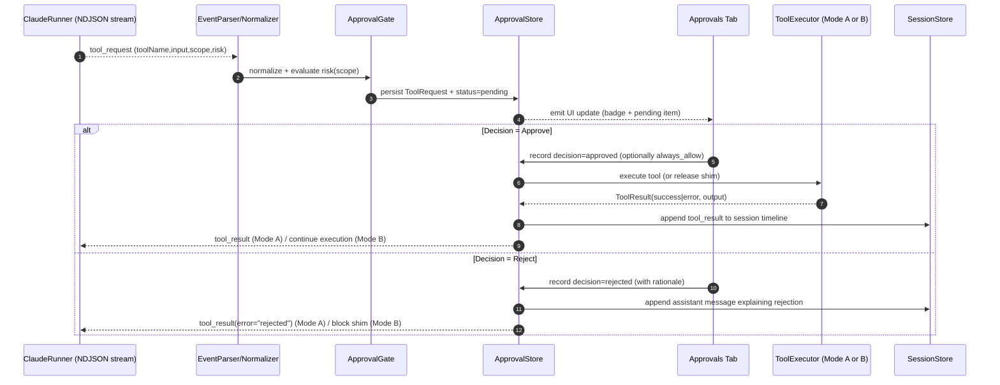
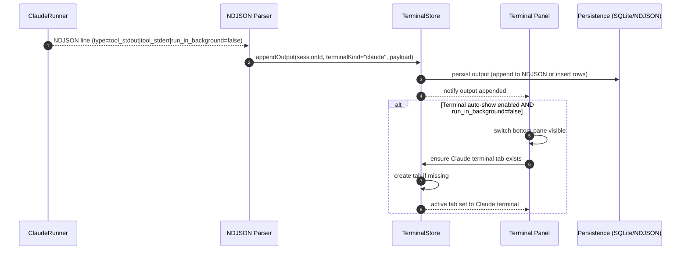

# Phase 2 UI Redesign: Blaze App


## System Contract (Authoritative)

This section defines the *non-negotiable contracts* between UI, stores, git worktrees, terminals, and the Claude Code runner. If any later section conflicts with this, **this contract wins**.

### 1) Canonical Terms

- **Repository / Project (repo)**: The directory the user selected in the New Session modal. Stored as `originalProjectPath`.
- **Session**: A single Claude Code run (chat + tools + terminals) associated with exactly one `originalProjectPath` and exactly one **worktree directory**.
- **Worktree directory**: The filesystem directory used as the session’s working directory. **Must** be:
  - `{repo}/.blaze-worktrees/<sessionId>/`
- **Worktrees root**: `{repo}/.blaze-worktrees/` (contains one subdirectory per session id).
- **Canonical path**: Absolute path with `~` expanded, standardized, and with symlinks resolved where safe (see Security Boundaries).

### 2) Directory & File Layout

Within a repo chosen by the user:

```
{repo}/
  .blaze-worktrees/
    <sessionId>/                 # worktree directory (git worktree checkout)
      ...                        # files visible to Claude + user
  .git/                          # git repo (or created if user explicitly consents)
  .claude/settings.json          # optional per-project Claude settings/hooks/MCP
  .blaze/                        # Blaze-managed metadata for this repo (optional)
    README.md
    repo.json                    # optional repo-level metadata (display name, pins)
```

**Rules**
- Blaze never writes inside `.git/` except via `git` commands.
- Blaze may create `.blaze/` only for Blaze metadata. User code never goes there.
- Worktrees are *always* inside the repo (not in `~/Library/...`) so they are portable with the repo folder.

### 3) Path Normalization & Identity

- `originalProjectPath` identity is the **canonical** absolute path of the repo root.
- Sessions are grouped in the sidebar by `originalProjectPath` only. Worktree paths must never be used for project grouping.
- Path canonicalization:
  1. Expand `~`
  2. Convert to absolute
  3. Standardize (`..`, `.`, duplicate slashes)
  4. Resolve symlinks **only within repo root** (see Security Boundaries); do not follow symlinks that escape the repo root when determining project identity.

### 4) Security Boundaries (Symlinks, Escapes, Dangerous Actions)

**File Tree / File View**
- Symlinks are displayed as symlinks.
- Blaze will **not** traverse a symlink target that resolves outside `{repo}` in the file tree by default.
  - Instead, show a warning badge and require an explicit user action: **“Reveal target in Finder”** or **“Open externally”**.
- This prevents accidental exposure of `~/.ssh`, `/etc`, secrets, etc.

**Tool Approvals**
- Tool executions are categorized by risk level.
- Any tool that can write outside the current worktree or run arbitrary shell commands is **High** risk by default and must be gated by the Approvals system unless TrustMode is fully unlocked.

### 5) Event Stream Contract (NDJSON)

Blaze treats the Claude runner’s output as a stream of newline-delimited JSON (**NDJSON**). Each line is a single event.

**Required invariants**
- Events are strictly ordered by emission time.
- Blaze must handle partial line reads (buffer until newline).
- Any malformed line is logged (with raw bytes) and skipped, without crashing the UI.

**Minimum event fields Blaze relies on**
- `type`: event type discriminator
- `timestamp`: ISO8601 or epoch millis
- `session_id`: session id if available (else Blaze injects it at ingestion boundary)
- `payload`: event-specific structured object

If Claude/runner cannot emit these fields today, Blaze must normalize incoming events into this internal shape.

### 6) Tool Execution & Approvals Contract

There are two implementation-compatible modes:

- **Mode A (preferred)**: Claude emits structured “tool_request” events; Blaze (or a Blaze tool-runner) executes tools and sends structured “tool_result” back to the runner.
- **Mode B (fallback)**: Blaze runs a local shim layer (PATH wrappers / interceptors) for risky tools (e.g., `bash`, `git`, file writers) and enforces approvals before delegating to the real binaries.

In both modes:
- A tool request is **not considered executed** until Blaze records:
  - `ToolRequest(id, ...)` → `ToolDecision(id, approved|rejected|always_allow, ...)` → `ToolResult(id, ...)` (if approved)
- Rejecting a tool must generate a user-visible assistant message explaining rejection and (optionally) a safer alternative.

### 7) TrustMode Contract

TrustMode is a per-session setting that drives approval gating.

- `LockedDown`: Block High + Medium; allow Low only.
- `Prompt`: Prompt for Medium + High.
- `Allowlisted`: Auto-allow if tool+scope matches allowlist; prompt otherwise.
- `Unrestricted`: No gating (still logged).

Allowlists are stored per-repo and/or global (see Persistence & Migration).

### 7.1) TrustMode Migration (CLARIFIED 2025-12-31)

Phase 2 uses a new 4-level TrustMode enum, replacing Phase 1's 3-level system:

| Phase 1 | Phase 2 | Notes |
|---------|---------|-------|
| `review` | `Prompt` | Prompt for Medium + High risk |
| `trusted` | `Allowlisted` | Auto-allow if tool+scope matches allowlist |
| `sandbox` | `LockedDown` | Block High + Medium; allow Low only |
| (new) | `Unrestricted` | No gating (still logged) |

**Migration:** Phase 1 sessions are marked `status = .archived` and remain read-only. No mapping between old and new TrustMode values is required.

### 8) Concurrency & Threading

- All filesystem and git operations are async and must be cancellable.
- UI state updates are main-thread only.
- If the user creates multiple sessions rapidly, worktree creation must serialize per-repo to avoid git lock contention; sessions for different repos may proceed concurrently.

### 8.1) Git Operation Serialization (CLARIFIED 2025-12-31)

Worktree operations serialize per-repo using a **per-repo Actor dictionary**:

```swift
actor RepoLockManager {
    private var repoActors: [String: RepoOperationActor] = [:]

    func withRepoLock<T>(_ canonicalPath: String, _ operation: () async throws -> T) async throws -> T {
        let actor = repoActors[canonicalPath, default: RepoOperationActor()]
        repoActors[canonicalPath] = actor
        return try await actor.execute(operation)
    }
}

actor RepoOperationActor {
    func execute<T>(_ operation: () async throws -> T) async throws -> T {
        try await operation()
    }
}
```

**Guarantees:**
- Operations on the same repo execute serially (actors auto-serialize)
- Operations on different repos execute concurrently
- No git lock contention within Blaze

---

## Overview

This plan implements a comprehensive UI redesign for Blaze based on the user's mockups, adding:
1. Projects hierarchy with git worktree isolation
2. File tree browser
3. Terminal panel with tabs
4. Chat/File View toggle
5. Expanded sidebar tabs
6. New session modal with directory selection

---

## Clarified Decisions Summary

> **Updated 2025-12-31** after CTO review and Q&A session.

| Area | Original | Clarified Decision |
|------|----------|-------------------|
| **Terminal** | Build from scratch (5 days) | SwiftTerm library + user-selectable backends |
| **Terminal scope** | Unspecified | Full xterm-256color |
| **File tree ignore** | Hardcoded hidden | Show all, collapse hidden folders by default (dimmed) |
| **Token tracking** | Full breakdown | 3-tier: Pre-loaded (estimated) + Live + Total |
| **MCP** | Full live status | Static config + tool usage tracking only |
| **Hooks** | Display only | Full form-based editor (→ visual builder later) |
| **Agents** | Full spec | Stub "Coming Soon" |
| **Sandbox** | Unspecified | Non-sandboxed app |
| **Accessibility** | Phase 2 | Deferred to Phase 3 |
| **Shortcuts** | Phase 2 | Deferred to later |
| **Timeline** | 30 days | 32 days |

---

## Key Architecture Decisions

| Decision | Choice | Rationale |
|----------|--------|-----------|
| **Git worktrees** | `{repo}/.blaze-worktrees/<sessionId>/` | Parallel agents without merge conflicts |
| **First session** | Always uses worktree | Consistency, even first session is isolated |
| **Worktree cleanup** | Prompt user on delete | User may want to keep work-in-progress |
| **Worktree branch naming** | `blaze-session-{short-uuid}` | Auto-generated, traceable |
| **Non-git directories** | Offer one-click `git init` with explicit user consent + preview of actions | Avoid accidental commits / unexpected repo creation |
| **Project grouping** | Computed from `originalProjectPath` (never from worktree path) | Stable grouping even as sessions use per-session worktrees |
| **Path normalization** | Canonical absolute paths | Prevents duplicate project entries |
| **Terminal implementation** | SwiftTerm library | Battle-tested, full xterm-256color |
| **Terminal backend selection** | User-facing Preferences setting | Ready for future alternatives (libghostty) |
| **Terminal auto-show** | Parse NDJSON for `run_in_background` | Reliable detection from event stream |
| **Sidebar organization** | Grouped collapsible panels | 17 tabs fit cleanly (Tab 17 Settings added 2025-12-31) |
| **View toggle** | Single view (no split yet) | Simpler, plan for future split |
| **App sandbox** | Non-sandboxed | Full shell config access (~/.zshrc, starship) |


## Persistence & Migration

This section specifies what is persisted, where it lives, how it migrates, and how users can back it up safely.

### (a) Storage tech

**Primary store**: SQLite (WAL mode) with explicit migrations (e.g., GRDB or SQLite.swift).  
Rationale: deterministic schema, fast queries for timeline/tools, safe incremental migrations, and robust concurrency on macOS.

**Secondary stores**
- **Raw session event logs**: NDJSON files on disk (append-only) for exact reproducibility / debugging.
- **Derived caches**: optional in-memory + on-disk caches for file tree snapshots, search indexes.

### (b) Storage location

**Global app database**
- `~/Library/Application Support/Blaze/blaze.sqlite`
- `~/Library/Application Support/Blaze/migrations/` (migration metadata)
- `~/Library/Application Support/Blaze/logs/` (Blaze internal logs; not user project logs)

**Per-session raw event logs**
- `~/Library/Application Support/Blaze/sessions/<sessionId>/events.ndjson`
- `~/Library/Application Support/Blaze/sessions/<sessionId>/terminals/<terminalId>.ndjson` (optional, if separating)

**Per-repo metadata (optional, minimal)**
- `{repo}/.blaze/repo.json` for lightweight “repo-local” settings (display name, pins), only if user opts in.

### (c) Schema versions + migrations

**Schema versioning**
- Maintain a single integer `schema_version` in SQLite (PRAGMA user_version or a migrations table).
- Each release increments the schema version with a forward-only migration.

**Migration rules**
- Migrations must be **idempotent** (safe to re-run).
- Backfill jobs (e.g., computing token aggregates from raw events) run in the background *after* the migration, but must not block app launch.
- Any migration failure must:
  1. Keep the old DB untouched (transactional migration)
  2. Show a clear error with a “Restore from backup” path

**Recommended core tables (minimum)**
- `repos(id, canonical_path, display_name, created_at, updated_at, last_opened_at)`
- `sessions(id, repo_id, original_project_path, worktree_path, branch_name, created_at, last_active_at, status, trust_mode)`
- `session_events(id, session_id, seq, type, timestamp, payload_json, raw_json_path?)`
- `tool_requests(id, session_id, timestamp, tool_name, input_json, risk_level, scope_json)`
- `tool_decisions(id, tool_request_id, decision, decided_at, decided_by, rationale, allowlist_rule_id?)`
- `allowlist_rules(id, scope_json, tool_name, created_at, created_by, expires_at?, enabled)`
- `terminal_tabs(id, session_id, kind, title, created_at, closed_at)`
- `terminal_output(id, terminal_id, seq, timestamp, payload_json)` (optional if not storing in NDJSON files)

### (d) Backup/restore

**Backup export**
- UI action: `Settings → Data → Export Backup…`
- Exports a single zip:
  - `blaze.sqlite`
  - `sessions/<sessionId>/events.ndjson` (optional toggle)
  - `settings.json` (global preferences, allowlists)
  - `manifest.json` (export version, timestamps, integrity hashes)

**Restore**
- UI action: `Settings → Data → Restore Backup…`
- Restore is performed into a *new* application support folder first, then swapped atomically.
- If restore fails, Blaze must revert automatically and keep the existing install intact.

---


## UX Decisions

| Interaction | Behavior |
|-------------|----------|
| **File tree single click** | Preview file (temporary tab, italic name) |
| **File tree double click** | Open file (persistent tab) |
| **File tree hidden items** | Shown but dimmed; hidden folders collapsed by default |
| **File path in chat** | Clickable → opens in File View |
| **Drag file to chat** | Inserts file reference for Claude |
| **Drag from Files sidebar** | Can drag to chat to reference |
| **Claude runs Bash** | Terminal panel auto-shows |
| **Click sidebar event** | Jumps to that point in chat |

---


## High-Risk Flow Sequence Diagrams (Authoritative)

These flows are the highest-risk because they touch git state, tool execution safety, and streaming logs. They are specified here as implementation-grade contracts.

### (a) New session → git init (optional) → worktree create → session persist → CLI spawn

```mermaid
sequenceDiagram
  autonumber
  actor U as User
  participant UI as Blaze UI (New Session Modal)
  participant SS as SessionStore
  participant GW as GitWorktreeManager
  participant G as Git (CLI)
  participant TR as ClaudeRunner (Process)
  participant TP as TerminalPanel

  U->>UI: Click "+"
  UI->>UI: Open NSOpenPanel + options
  U->>UI: Select directory {repo}
  UI->>GW: checkIsGitRepo({repo})
  alt repo is NOT a git repo
    UI->>U: Show "Initialize Git" consent + preview actions
    U->>UI: Confirm init (or cancel)
    UI->>GW: initRepoWithConsent({repo})
    GW->>G: git init
    GW->>G: git add -A (scope: repo only; optional)
    GW->>G: git commit -m "Initial commit" (only if add succeeded & user consented)
    GW-->>UI: success/failure
  end

  UI->>SS: createSession(originalProjectPath={repo}, trustMode=default)
  SS-->>UI: sessionId
  UI->>GW: createWorktree(repo={repo}, sessionId)
  GW->>G: git worktree add {repo}/.blaze-worktrees/<sessionId>/ -b blaze-session-<short>
  GW-->>UI: worktreePath + branchName

  UI->>SS: updateSession(sessionId, worktreePath, branchName, status="ready")
  UI->>TR: spawnClaude(workdir=worktreePath, stream=NDJSON)
  TR-->>TP: stream output lines
  UI-->>U: Session appears under project; chat opens
```

**Important guarantees**
- Worktree is created only after user consents to any git init actions.
- Session is persisted **before** spawning Claude, so crash recovery can show “incomplete setup” and clean up.

### (b) Tool call event stream → approval gate → allow/deny → UI update



**Key invariants**
- Every tool_request must become either approved or rejected; no “silent drop”.
- Decisions and results are persisted before being shown as completed.

### (c) NDJSON tool output → terminal auto-show → tab creation → output persistence



**Guarantees**
- Output is persisted even if UI is hidden.
- Auto-show is driven by structured signals (not heuristics).

---


## Feature 1: New Session Modal + Git Worktrees

### Goal
- Provide a single, safe entry point to start a new Claude Code session that is **isolated by default** (git worktree) and reproducible.
- Ensure the user can point Blaze at *any* folder (git or non-git) and receive clear, consent-driven actions.

### Non-goals
- Full git UI (merge, rebase, conflict resolution UI) beyond status and basic actions.
- Remote operations (clone/push/pull) in Phase 2 unless already available elsewhere.
- Multi-repo sessions or cross-repo worktrees.

### Data model
**Session**
- `id: UUID` (canonical `<sessionId>`)
- `originalProjectPath: String` (canonical repo root)
- `worktreePath: String` = `{repo}/.blaze-worktrees/<sessionId>/`
- `branchName: String` = `blaze-session-<short-uuid>` (unique per session)
- `createdAt, lastActiveAt: Date`
- `status: enum { creating, ready, running, stopped, errored, archived }`
- `trustMode: TrustMode`
- `runnerConfig: struct { model?, outputStyle?, mcpEnabled?, hooksEnabled? }`

### Session Migration Strategy (CLARIFIED 2025-12-31)

**Approach:** Clean break with archived legacy sessions.

- Phase 2 sessions use new schema fields: `originalProjectPath`, `worktreePath`, `branchName`, `status`
- Phase 1 sessions receive `status = .archived` (read-only, no worktree operations)
- No ALTER TABLE migration required - Phase 1 data retained in existing columns
- UI shows archived sessions in "Legacy Sessions" group with `(archived)` badge

```swift
enum SessionStatus: String, Codable {
    case creating     // Worktree being created
    case ready        // Ready to start
    case running      // Claude CLI active
    case stopped      // Paused/stopped
    case errored      // Failed state
    case archived     // Phase 1 legacy session (read-only)
}
```

**RepoMetadata (optional)**
- `canonicalPath, displayName, pinnedOrder, lastOpenedAt`

### State ownership
- **UI (New Session Modal)** owns transient form state only.
- **SessionStore** owns persisted session records, emits session list updates.
- **GitWorktreeManager** owns execution of git commands and reports structured errors.
- **AppState** owns current selection: `selectedSessionId`, `selectedRepoId`, `centerPaneMode`.

### UI Interactions
- "+" button opens New Session modal.
- Directory picker (NSOpenPanel) with:
  - repo path selection
  - checkbox: “Initialize Git if needed (creates .git)” (default OFF until detection says non-git)
  - checkbox: “Create initial commit” (only shown when init is selected; default OFF; shows preview of files to be committed)
  - advanced: “Use existing branch” vs “Create new session branch” (default new)
- “Preview actions” panel shows exact steps Blaze will run before user confirms.
- Primary action button: **Create Session**
- Cancel closes modal without side effects.

### Error states
- Repo path invalid / permission denied → show error + “Open Finder / Retry”
- Git not installed / not in PATH → show error + remediation steps
- `git init` fails (read-only FS) → abort; no session created
- `git commit` fails (missing user.name/email) → if commit requested, show fix steps; allow proceeding without commit
- Worktree creation fails due to:
  - existing directory collision at `.blaze-worktrees/<sessionId>/` (should never happen; treat as fatal + regenerate sessionId)
  - existing branch name collision (regenerate branch suffix)
  - git lock contention (retry with backoff; serialize per repo)

### Telemetry/logging
- Log structured events:
  - `session_create_started`, `git_init_requested`, `worktree_create_started/succeeded/failed`, `runner_spawned`
- Capture timing metrics:
  - time-to-session-ready, time-to-runner-spawn
- Persist failure diagnostics (stderr + exit codes) for support.

### Acceptance tests
- Create session in existing git repo:
  - results in `.blaze-worktrees/<sessionId>/` existing and `git worktree list` includes it
  - session workdir equals that path
- Create session in non-git folder with init OFF:
  - modal blocks creation and explains requirement OR offers init (no silent init)
- Create session in non-git folder with init ON + commit OFF:
  - `.git` created; no commit required; worktree still created
- Create session with init ON + commit ON:
  - if user.name/email missing, prompt; allow “Proceed without commit”
- Create 3 sessions rapidly in same repo:
  - no git lock errors; worktrees all created; UI shows 3 sessions
- Crash mid-creation:
  - on relaunch, orphan scan detects incomplete worktree; offers cleanup

### Acceptance Tests - Edge Cases (CLARIFIED 2025-12-31)

- Orphan worktree exists without session → detected on launch, user prompted with options
- Multiple orphans → batch prompt with individual checkboxes for delete/keep
- Claude CLI not installed → New Session modal shows warning banner with install link
- Existing sessions remain viewable but cannot start new runs without CLI
- Worktree creation fails due to git error → session creation aborted, clear error shown

### Behavior
1. User clicks "+" button
2. Modal appears with directory picker (NSOpenPanel)
3. User selects a project directory
4. App checks if project exists in left sidebar
   - If not: creates project group entry
   - If yes: nests session under existing project
5. App creates git worktree: `{projectDir}/.blaze-worktrees/<sessionId>/`
6. Session's `worktreePath` is set to the worktree directory; `originalProjectPath` remains the repo root
7. CLI runs in worktree directory

### Error Handling (CLARIFIED)

| Scenario | Behavior |
|----------|----------|
| **Worktree creation fails** | Abort session creation, show error message |
| **Orphaned worktrees** | Scan on app launch, prompt user to delete or keep |
| **User deletes worktree externally** | Detect on next session open, show warning |

### Orphan Detection on Startup

```swift
func scanForOrphanWorktrees() async -> [OrphanWorktree] {
    var orphans: [OrphanWorktree] = []

    for projectPath in knownProjectPaths {
        let worktreeDir = projectPath.appendingPathComponent(".blaze-worktrees")
        guard worktreeDir.exists else { continue }

        for worktree in worktreeDir.children {
            let sessionId = extractSessionId(from: worktree.name)
            if !sessionStore.exists(sessionId) {
                orphans.append(OrphanWorktree(
                    path: worktree,
                    projectPath: projectPath,
                    lastModified: worktree.modificationDate
                ))
            }
        }
    }
    return orphans
}
```

### Startup Dialog for Orphans

```
┌─────────────────────────────────────────────────────────┐
│ Orphaned Worktrees Found                                 │
├─────────────────────────────────────────────────────────┤
│ Found 2 git worktrees without matching sessions:        │
│                                                         │
│ □ /Projects/myapp/.blaze-worktrees/abc123/              │
│   Last modified: 2 days ago                             │
│                                                         │
│ □ /Projects/webapp/.blaze-worktrees/def456/             │
│   Last modified: 1 week ago                             │
│                                                         │
│ [Delete Selected]  [Keep All]  [Remind Me Later]        │
└─────────────────────────────────────────────────────────┘
```

### Files to Create/Modify
- `Sources/UI/NewSessionModal.swift` - NEW: Modal sheet with directory picker
- `Sources/Core/GitWorktreeManager.swift` - NEW: Worktree create/delete/list
- `Sources/Data/SessionStore.swift` - Add `worktreePath` field
- `Sources/Core/Models.swift` - Add `worktreePath: String?` to Session
- `Sources/App/ContentView.swift` - Wire up modal to "+" button

### GitWorktreeManager API
```swift
actor GitWorktreeManager {
    func createWorktree(
        repoPath: String,
        sessionId: UUID,
        branch: String? = nil  // nil = new branch from HEAD
    ) async throws -> URL

    func removeWorktree(worktreePath: URL) async throws
    func listWorktrees(repoPath: String) async throws -> [WorktreeInfo]
    func pruneStaleWorktrees(repoPath: String) async throws
    func scanForOrphans() async throws -> [OrphanWorktree]  // NEW
}
```

### Git Commands Used
```bash
# Initialize git if not a repo (user selected non-git directory)
git -C {repoPath} init

# Create worktree with auto-named branch
git -C {repoPath} worktree add {worktreePath} -b blaze-session-{short-uuid}

# Remove worktree
git -C {repoPath} worktree remove {worktreePath}

# Prune stale entries
git -C {repoPath} worktree prune
```

### NewSessionModal Flow
```
1. User clicks "+"
2. Modal appears with NSOpenPanel
3. User selects directory
4. Check if git repo: `git -C {dir} rev-parse --git-dir`
   - If not: run `git init` + initial commit
5. Generate sessionId (UUID)
6. Create worktree: `.blaze-worktrees/<sessionId>/`
7. Create branch: `blaze-session-{short-uuid}`
8. Create Session with originalProjectPath and worktreePath
9. CLI runs in worktree directory
```

---

## Feature 2: Projects Hierarchy (Left Sidebar - Top)

### Goal
- Provide a stable, low-friction navigation hierarchy: **Projects (repos)** → **Sessions**.
- Ensure grouping is deterministic (by `originalProjectPath`) and robust to worktree churn.

### Non-goals
- “Move session between projects” by changing underlying repo association (not supported in Phase 2).
- Deep workspace management (tags/folders) unless explicitly added as a separate feature.

### Data model
**Derived ProjectGroup (view model)**
- `id = hash(canonical originalProjectPath)`
- `name = basename(originalProjectPath)` (displayName override optional)
- `canonicalPath`
- `sessions: [SessionSummary]` sorted by `lastActiveAt DESC`

### State ownership
- **SessionStore**: persisted sessions, emits updates.
- **ProjectGrouping**: computed view over sessions (pure function).
- **AppState**: expanded/collapsed projects, selection, sort mode.

### UI Interactions
- Expand/collapse project groups.
- Click session → selects it and opens chat view.
- Context menu on project:
  - “Reveal in Finder”
  - “Copy Path”
  - “Rename Display Name…” (optional; stored in RepoMetadata; does not change path)
- Drag-and-drop:
  - Reorder projects (pinned order)
  - Reorder sessions **within the same project group**
  - Dropping a session onto a different project shows “Not supported” tooltip (explicit).

### Error states
- Repo folder moved or deleted:
  - project group remains but shows warning badge “Missing”
  - actions: “Locate…” (user picks new folder) OR “Remove from list”
- Permissions changed:
  - show “No access” state; do not crash; keep sessions visible but disabled.

### Telemetry/logging
- project expand/collapse events
- session selection changes
- missing repo detection counts

### Acceptance tests
- Two sessions created from same repo must appear under one project group.
- Worktree paths must never create additional project groups.
- Reordering persists across restart.
- Missing repo shows warning and does not break file tree/terminals.


### Behavior
- Sessions auto-group by their `originalProjectPath` (repo root; never by worktree path)
- Display: Project name → nested sessions
- Collapsible project folders
- Drag-and-drop to reorder projects and reorder sessions **within the same project** (moving sessions between different repos is not supported in Phase 2; show tooltip if attempted).
- Project name = directory basename (e.g., `/Users/x/Projects/blaze` → "blaze")

### Path Normalization (CLARIFIED)
- All paths resolved to absolute canonical form before storing
- `~` expanded to `/Users/username`
- Symlinks resolved
- This prevents duplicate project entries for same directory

### Orphan Sessions (CLARIFIED)
- Sessions with no `originalProjectPath` appear in special "Uncategorized" group at bottom
- Legacy sessions or quick-start sessions go here

### Data Model Changes
```swift
// SessionStore.swift - Add grouping query
func getGroupedByProject() async throws -> [ProjectGroup]

// Models.swift - Add to Session
struct Session {
    // ... existing fields
    var originalProjectPath: String?  // The actual repo path (canonical)
    var worktreePath: String?         // The .blaze-worktrees-{id}/ path
}

// NEW: Project grouping
struct ProjectGroup {
    let name: String           // Directory basename
    let canonicalPath: String  // Full canonical path
    var sessions: [Session]
    var isExpanded: Bool
}
```

### Files to Create/Modify
- `Sources/UI/ProjectListView.swift` - NEW: Replaces flat SessionListView
- `Sources/UI/ProjectSection.swift` - NEW: Collapsible project folder
- `Sources/Data/SessionStore.swift` - Add grouping queries
- `Sources/App/BlazeApp.swift` - Add `projectGroups`, `expandedProjects` to AppState

---

## Feature 3: File Tree (Left Sidebar - Bottom)

### Goal
- Provide a fast, safe file browser over the **session worktree** with predictable preview/open behaviors and first-class “reference in chat” flows.

### Non-goals
- Full IDE (refactors, symbol search) in Phase 2.
- Git diffs inside file tree nodes (belongs in Git tab).

### Data model
- `FileNode(id, name, url, kind=file|folder|symlink, isHidden, size?, mtime?, children?)`
- `FileTreeSnapshot(sessionId, rootUrl, nodesById, flatVisibleCount)`
- `OpenFileTab(id, url, isTemporary, lastViewedAt)`

### State ownership
- **FileTreeStore** owns snapshots + watchers per selected session.
- **AppState** owns open file tabs + selected file.
- **FileView** owns editor/preview state (scroll position, selection).

### UI Interactions
- Single click → preview in temporary tab (italic title)
- Double click → open persistent tab
- Right click context menu:
  - Open, Open in New Tab
  - Reveal in Finder
  - Copy Path
  - Copy Relative Path (to repo root)
- Drag file to chat:
  - inserts a stable reference token, e.g. `@file:relative/path` plus absolute on hover
- Hidden items:
  - visible but dimmed
  - hidden folders collapsed by default
- Symlinks:
  - show symlink badge and target path preview
  - do not traverse outside repo root without explicit user action.

### Error states
- File deleted between render and open → show toast “File no longer exists”
- Permission denied → show inline error row; allow Reveal in Finder
- Symlink target missing → show broken link badge; opening shows error.

### Telemetry/logging
- file tree render time per snapshot
- visible node count
- watcher event rates (rename/create/delete)

### Acceptance tests
- Render 1000-file tree in <100ms on target hardware (measure with instrumentation).
- Clicking/Double clicking results in correct tab behavior (temporary vs persistent).
- Dragging file inserts correct reference token.
- Symlink escaping repo root is blocked by default.

### Acceptance Tests - Edge Cases (CLARIFIED 2025-12-31)

- Repo moved while app running → file tree shows "Folder moved" state with warning banner
- User can "Relocate" (pick new path) or "Remove from list"
- Binary file in tree → shows appropriate icon (image, pdf, executable, generic binary)
- Single-click binary → shows "Binary file - X bytes" info with type detection
- Double-click binary → offers "Open with default app" or "Reveal in Finder"
- Very long file paths → truncate in tree view, show full path on hover tooltip

### Behavior
- Shows when a project/session is selected
- Displays file tree of active session's worktree
- Collapsible folders with lazy loading
- File icons by extension
- Click file to open in File View

### Hidden File Handling (CLARIFIED)
- **Show all files and folders** (nothing completely hidden)
- **Hidden folders** (`.git`, `node_modules`, `.build`, etc.) collapsed by default
- **Hidden items** rendered with 0.6 opacity (dimmed)
- **User can expand** hidden folders if needed

### Symlink Handling (CLARIFIED)
- Display symlinks with a badge. **Do not traverse targets outside `{repo}` by default**; allow explicit “Open externally / Reveal in Finder” instead (see System Contract).
- Cycle detection to prevent infinite recursion
- Track visited canonical paths

### File Watching (CLARIFIED)
- Use macOS FSEvents for monitoring
- Auto-refresh affected directories on external changes
- Debounce rapid changes

### FSEvents Configuration (CLARIFIED 2025-12-31)

```swift
let fsEventsConfig = FSEventsConfig(
    debounceInterval: .milliseconds(250),  // 250ms debounce
    eventCoalescing: true,                 // Coalesce per-directory
    eventTypes: [.create, .delete, .rename, .modify],
    burstMode: .coalesce(maxDelay: .seconds(2))  // Cap burst coalescing at 2s
)
```

**Behavior:**
- Events within 250ms window are coalesced per-directory
- During large operations (e.g., `npm install`), burst mode caps delay at 2s
- After burst completes, single refresh of affected directories
- Subscribe to: create, delete, rename, modify events

### Performance Target (CLARIFIED)
- 1000 visible files must render in <100ms
- Requires virtualized list (only render visible rows)
- Lazy-load directory contents on expand

### Virtualization Approach (CLARIFIED 2025-12-31)

**Target:** 1000 visible files < 100ms render

```swift
struct FileTreeVirtualization {
    static let rowHeight: CGFloat = 24        // Fixed height for fast calculation
    static let overscanBuffer: Int = 50       // Pre-render 50 items above/below viewport
    static let recyclePoolSize: Int = 100     // Reuse views for performance
}
```

**Implementation:**
- Fixed 24px row height enables O(1) scroll position calculation
- 50-item overscan buffer prevents flicker during fast scroll
- Use `LazyVStack` with explicit frame heights
- Measure performance with `signpost` instrumentation

### Data Model
```swift
struct FileTreeNode: Identifiable {
    let id: UUID
    let url: URL
    let name: String
    let isDirectory: Bool
    let isHidden: Bool      // .hasPrefix(".") or file attribute
    let isSymlink: Bool
    var isExpanded: Bool    // Default false for hidden folders
    var children: [FileTreeNode]?  // Lazy loaded

    var shouldAutoExpand: Bool {
        isDirectory && !isHidden
    }

    var opacity: Double {
        isHidden ? 0.6 : 1.0
    }
}
```

### Cycle Detection
```swift
func loadChildren(for node: FileTreeNode, visited: inout Set<String>) throws -> [FileTreeNode] {
    let resolvedPath = try node.url.resolvingSymlinksInPath().path
    guard !visited.contains(resolvedPath) else {
        return []  // Cycle detected, don't recurse
    }
    visited.insert(resolvedPath)
    // ... load children
}
```

### Files to Create
- `Sources/Core/FileTreeNode.swift` - NEW: Tree node model
- `Sources/UI/FileTreeView.swift` - NEW: Tree view component
- `Sources/UI/FileTreeViewModel.swift` - NEW: Lazy loading logic + FSEvents

---

## Feature 4: Terminal Panel (Bottom Right) - CLARIFIED

### Goal
- Provide a reliable terminal surface for:
  - **User terminals** (interactive PTY) and
  - **Claude terminals** (tool output stream, read-only)
- Support auto-show when Claude runs foreground shell tools.

### Non-goals
- Keep PTY processes alive after app quit (explicitly out of scope).
- Full tmux-like multiplexing or split panes in Phase 2.

### Data model
- `TerminalTab(id, sessionId, kind=user|claude, title, createdAt, isActive, scrollbackLimit=10000)`
- `TerminalProcess(id, tabId, pid, command, startedAt, exitCode?)` (user terminals only)
- `TerminalOutputEvent(seq, ts, stream=stdout|stderr, text|bytes)` (claude terminals primarily)

### State ownership
- **TerminalManager** owns PTY lifecycle and stream ingestion.
- **TerminalStore** owns tab list + scrollback buffers + persistence pointers.
- **AppState** owns panel visibility and selected tab.

### UI Interactions
- Bottom-right terminal panel:
  - Tabs row (User terminals + Claude terminal)
  - “+” creates new user terminal tab
  - Close tab button (prompts if process running)
  - Search within buffer (optional)
- Auto-show:
  - If NDJSON indicates `run_in_background=false` and user pref enabled → reveal terminal and focus Claude tab.
- Copy/paste, select text, clear buffer.
- Export terminal output for a session.

### Error states
- PTY spawn fails (shell missing) → show error with “Set default shell…” action.
- SwiftTerm render errors → fallback to plain text view (no crash).
- NDJSON parser errors → log and continue; show “some lines skipped” badge.

### Telemetry/logging
- terminal spawn latency
- output throughput (lines/sec)
- parser error counts

### Acceptance tests
- Create user terminal, run `echo test`, output appears.
- Claude tool output appears in Claude terminal even if hidden.
- Auto-show triggers only when foreground tool runs.
- Scrollback capped at 10k lines with correct truncation.


### Implementation Decision
**Use SwiftTerm library** instead of building from scratch.

| Aspect | Decision | Rationale |
|--------|----------|-----------|
| **Library** | SwiftTerm | Battle-tested, MIT license, full xterm-256color |
| **Backend selection** | User-facing Preferences | Ready for future alternatives (libghostty) |
| **Scrollback** | Fixed 10K lines | ~2MB per terminal, predictable memory |
| **Persistence** | Output saved, processes die on quit | Simple, no zombies |
| **Sandbox** | Non-sandboxed app | Full ~/.zshrc, starship access |

### Terminal Backend Protocol (for future extensibility)
```swift
protocol TerminalBackend {
    func spawn(shell: String, cwd: URL, env: [String: String]) async throws
    func write(_ data: Data)
    func resize(cols: Int, rows: Int)
    var outputStream: AsyncStream<Data> { get }
    func terminate()
}

// Primary implementation
class SwiftTermBackend: TerminalBackend { ... }

// Future: libghostty
// class GhosttyBackend: TerminalBackend { ... }
```

### Behavior
- User clicks "+" to spawn terminal tab
- Claude can spawn terminals via `run_in_background: true` Bash calls
- Each terminal is its own tab
- Live output streaming with full xterm-256color support
- User terminals: full PTY (interactive)
- Claude terminals: output display only

### Auto-Show Detection (CLARIFIED)
Parse NDJSON events for `run_in_background: true` on Bash tool calls:
```swift
class ClaudeBackgroundDetector {
    func shouldAutoShowTerminal(event: NormalizedEvent) -> Bool {
        guard case .toolCallStarted(let call) = event else { return false }
        return call.name == "Bash" &&
               call.input["run_in_background"] as? Bool == true
    }
}
```

### Preferences UI
```
┌─────────────────────────────────────────────────────────┐
│ Terminal Settings                                        │
├─────────────────────────────────────────────────────────┤
│ Terminal Backend: [SwiftTerm ▾]                          │
│                   • SwiftTerm (Default)                  │
│                   • Ghostty (Coming Soon)                │
│                                                         │
│ Scrollback Lines: [10000      ]                         │
│                                                         │
│ Default Shell:    [/bin/zsh   ]                         │
└─────────────────────────────────────────────────────────┘
```

### Files to Create
```
Sources/Terminal/
├── TerminalBackend.swift           # Protocol
├── SwiftTermBackend.swift          # SwiftTerm implementation
├── TerminalSession.swift           # Session model
├── TerminalBuffer.swift            # 10K line ring buffer
├── TerminalManager.swift           # Central management
└── ClaudeBackgroundDetector.swift  # NDJSON event parser

Sources/UI/Terminal/
├── TerminalPanelView.swift
├── TerminalTabBar.swift
└── TerminalContentView.swift       # SwiftTermView wrapper
```

### Dependencies
Add to `Package.swift`:
```swift
.package(url: "https://github.com/migueldeicaza/SwiftTerm.git", from: "1.0.0")
```

### Integration Points
- `Sources/Engine/ClaudeEventMapper.swift` - Detect `run_in_background` Bash calls
- `Sources/App/ContentView.swift` - Add terminal panel to layout
- `Sources/App/BlazeApp.swift` - Add TerminalManager to environment

---

## Feature 5: Chat/File View Toggle (Center Pane)

### Goal
- Provide a single center pane that switches between **Chat** and **File View** without losing context, supporting both “read code” and “talk to Claude” workflows.

### Non-goals
- Split view (chat + file simultaneously) in Phase 2.
- Multi-window session editing.

### Data model
- `CenterPaneMode = chat | file`
- `FileViewState(openTabs[], activeTabId, previewTabId?)`

### State ownership
- **AppState** owns center pane mode and the active session.
- **FileViewStore** owns open tabs and preview/persistent semantics.

### UI Interactions
- Toggle control (Chat ↔ File View) always visible.
- Any “open file” action switches to File View and selects relevant tab.
- Chat file references are clickable; click opens File View tab at that file.
- Returning to Chat preserves scroll position and selection.

### Error states
- File referenced in chat missing → show message + offer “Locate file in repo”
- Session not selected → show empty state.

### Telemetry/logging
- mode switch counts
- open-file-from-chat counts

### Acceptance tests
- Clicking file in file tree opens preview tab and switches pane.
- Clicking file reference in chat opens persistent tab and switches pane.
- Switching back to chat restores scroll and does not lose conversation state.


### Behavior
- Toggle buttons above center pane: "Chat View" | "File Diff View"
- Chat View = existing ChatTimelineView
- File View = tabbed file viewer with:
  - Markdown rendering for .md files
  - Syntax highlighting for code
  - Diff view for modified files (reuse DiffViewer)

### Files to Create/Modify
- `Sources/UI/CenterPaneToggle.swift` - NEW: Segmented toggle
- `Sources/UI/FileViewerView.swift` - NEW: Tabbed file viewer
- `Sources/UI/FileTabBar.swift` - NEW: Horizontal tabs
- `Sources/UI/FileContentView.swift` - NEW: Render file content
- `Sources/UI/SyntaxHighlighter.swift` - NEW: Extract from DiffViewer
- `Sources/App/ContentView.swift` - Add toggle and conditional rendering
- `Sources/App/BlazeApp.swift` - Add `centerPaneMode`, `openFileTabs` to AppState

---

## Feature 6: Comprehensive Sidebar System (17 Tabs - CLARIFIED 2025-12-31)

### Goal
- Provide a comprehensive, discoverable sidebar with 17 tabs grouped into collapsible categories, giving users full control/visibility into session activity, files, and system settings.
- Tab 17 (Settings) split from Tab 12 (Sessions) per clarification 2025-12-31.

### Non-goals
- User-defined tab plugins in Phase 2.
- Arbitrary reordering of tabs beyond the provided grouped layout (unless explicitly added).

### Data model
- `SidebarGroup(id, title, tabIds[], isExpanded)`
- `SidebarTabId` enum (16 values)
- `SidebarState(activeTabId, expandedGroupIds, searchQueryByTab?)`

### State ownership
- **AppState** owns `SidebarState` and persists it across restarts.
- Each tab has its own store:
  - e.g., `TimelineStore`, `ToolStore`, `BookmarkStore`, `HookStore`, `MCPStore`, `ApprovalStore`, etc.

### UI Interactions
- Click tab to activate.
- Keyboard shortcuts to jump to key tabs (e.g., ⌥1 Timeline, ⌥2 Tools, etc.)
- Collapsible group headers remember state across restarts.
- Tab badges show counts (pending approvals, errors, tasks due).

### Error states
- Store init failure → show “Reload tab” button + log error.
- Missing session → show empty state per tab (no crash).

### Telemetry/logging
- tab switch events and dwell time (local only unless user opts in)
- badge count changes (approvals pending, errors)

### Acceptance tests
- Sidebar renders all 17 tabs in correct groups.
- Switching tabs does not reset unrelated tab state.
- Badges update in real-time as events stream in.


### Organization: Grouped Categories with Collapsible Panels

```
┌─────────────────────────────────────┐
│ ▼ ACTIVITY                          │
│   Timeline │ Tools │ Tasks          │
├─────────────────────────────────────┤
│ ▼ FILES & CODE                      │
│   Files │ Git │ Search │ Bookmarks  │
├─────────────────────────────────────┤
│ ▼ SYSTEM                            │
│   Tokens │ MCP │ Hooks │ Logs       │
├─────────────────────────────────────┤
│ ▼ NAVIGATION                        │
│   Sessions │ Prompts │ Agents       │
├─────────────────────────────────────┤
│ ▼ GOVERNANCE                        │
│   Approvals │ Context               │
└─────────────────────────────────────┘
```

Each category is a collapsible disclosure. Tabs within are icon buttons.

---

### Tab 1: Timeline (Existing, Enhanced)

#### Goal
- Provide a chronological, scrollable **session activity ledger** that answers: “What happened, when, and why?”
- Make it the fastest way to jump to a point in the chat/tool history without scrolling the main chat.

#### Non-goals
- Replace the main chat transcript view.
- Serve as a full audit export (export belongs in Logs/Settings).

#### Data model
- Source: `session_events` (ordered by `seq`, then `timestamp`).
- Display rows are derived from event types:
  - `user_message`, `assistant_message`
  - `tool_request`, `tool_result`
  - `approval_decision`
  - `file_opened`, `file_modified` (optional if available)
  - `terminal_autoshow` (derived)
- Each row must include: `eventId`, `sessionId`, `seq`, `timestamp`, `summary`, `severity?`, `jumpTarget`.

#### State ownership
- `TimelineStore` owns:
  - incremental ingestion cursor (`lastSeqSeen`)
  - filters (type filters, severity filters)
  - search query
- `AppState` owns the active session and selection.

#### UI Interactions
- Filters:
  - Event types (Messages / Tools / Files / System)
  - Severity (Info/Warning/Error)
  - Time range (All / Last 15m / Last 1h / Today)
- Search within timeline (regex optional).
- Click row:
  - message → jump chat to message id
  - tool → open Tools tab with that tool highlighted
  - approval → open Approvals tab with decision highlighted
- Context menu: Copy summary, Copy raw JSON (dev mode), Reveal related file.

#### Error states
- Missing/partial events → show “partial timeline” banner; continue ingestion.
- Malformed NDJSON line → log and show “N parse errors” badge; never crash.

#### Telemetry/logging
- ingestion latency (ms behind live)
- rows rendered per second
- parse error count

#### Acceptance tests
- With 10k events, timeline remains scroll-smooth (virtualized).
- Clicking a tool event opens the correct tool detail and aligns the chat.
- Timeline remains consistent after app restart (same ordering, no duplicates).


**Purpose**: Chronological event stream showing everything that happened.

**Content**:
- Event list with timestamps (relative: "2m ago")
- Filter chips: All, Content, Tools, Files, System, Errors
- Event categories with colored badges
- Click event → jumps to that point in chat
- Duration histogram showing activity over time

**Data Source**: `sessionEvents[sessionId]` filtered by category

**Enhancements for Phase 2**:
- Add "Jump to in Chat" action on each event
- Add event grouping (collapse sequential same-type events)
- Add mini-timeline scrubber at top

---

### Tab 2: Tools (Existing, Enhanced)

#### Goal
- Provide a structured inventory of **tool activity** (calls, inputs, outputs, durations) to debug agent behavior fast.
- Surface risk and approval status prominently.

#### Non-goals
- Replace Approvals tab (approval workflow lives there).
- Execute tools manually from this tab (Phase 2 read-first).

#### Data model
- Source: `tool_requests`, `tool_decisions`, `tool_results` (derived or separate table).
- Each tool row:
  - `toolRequestId`, `toolName`, `riskLevel`, `status` (pending/approved/rejected/succeeded/failed)
  - `startedAt`, `endedAt`, `durationMs`
  - `inputPreview`, `outputPreview`
  - `scope` (files touched, cwd, network domain, etc.)

#### State ownership
- `ToolStore` owns tool list and selected tool id.
- `ApprovalStore` is the source of truth for `pending/decision`.

#### UI Interactions
- Default view: list grouped by status (Pending first), then newest.
- Filters:
  - risk level
  - tool name
  - status
- Detail pane:
  - full input/output JSON (collapsible)
  - stdout/stderr links to terminal output
  - “Open in Approvals” if gated
- Context menu: Copy command, Copy output, Export tool record.

#### Error states
- Tool output too large → store on disk, show truncated preview + “Open raw”.
- Missing decision linkage → show “unknown” badge and log inconsistency.

#### Telemetry/logging
- average tool duration by tool name
- count of rejected tools per session
- store/linkage consistency checks

#### Acceptance tests
- Tool list updates in real-time as NDJSON arrives.
- Selecting a tool shows exact input/output and matches timeline entry.
- Pending tools appear in Approvals tab simultaneously (same ids).


**Purpose**: Tool execution dashboard with status.

**Content**:
- List of all tool calls this session
- Status indicator: ⏳ Running, ✅ Success, ❌ Failed
- Expandable input/output preview
- Duration for each call
- Filter by tool name

**Data Source**: `sessionEvents` filtered to `toolCallStarted`/`toolCallComplete`

**Enhancements for Phase 2**:
- Add tool usage statistics (count per tool type)
- Add "Re-run" button for failed tools
- Group by tool category (File, Bash, Web, etc.)

---

### Tab 3: Tasks

#### Goal
- Provide an actionable list of **tasks / to-dos** extracted from the session: what Claude intends to do, what’s done, what’s blocked.

#### Non-goals
- Full project management (kanban, multi-user) in Phase 2.
- Tasks as the authoritative plan source over the chat (chat remains canonical).

#### Data model
- `TaskItem(id, sessionId, title, status, createdAt, updatedAt, sourceMessageId?, tags?, dueAt?, assignee="Claude|User")`
- Status: `proposed | accepted | in_progress | blocked | done | dropped`
- Optional linkage to tool requests and files.

#### State ownership
- `TaskStore` owns the list and status transitions (user edits).
- `SessionStore` provides session linkage.

#### UI Interactions
- Add task manually (+)
- Promote a chat message to task (context menu “Create Task”)
- Toggle status (checkbox), set “blocked reason”
- Filter by status; sort by newest or due date
- Clicking a task jumps to the originating message/tool/files.

#### Error states
- Missing source message/file → task still renders with degraded navigation.
- Conflicts (two edits) → last-write-wins + show toast.

#### Telemetry/logging
- tasks created per session
- completion rate
- average time-to-done

#### Acceptance tests
- Create task from a chat message; clicking navigates back.
- Mark blocked; blocked reason is persisted and restored after restart.
- 500 tasks still scroll smoothly.


**Purpose**: AI-generated todo items and pending actions.

**Content**:
- Task list with checkboxes
- Status: ○ Pending, ◐ In Progress, ● Complete
- Source attribution (which message created this task)
- Manual add/edit/delete
- Drag to reorder

**Data Source**: Extracted from `TodoWrite` tool calls + manual additions

**Detail Spec**:
```swift
struct AITask {
    let id: UUID
    let sessionId: UUID
    let content: String
    var status: TaskStatus  // pending, inProgress, completed
    let createdAt: Date
    var completedAt: Date?
    let sourceMessageId: UUID?  // Links to chat message
    var isManual: Bool  // User-created vs AI-created
}
```

**Actions**:
- Click checkbox → toggle status
- Click task → scroll to source message in chat
- Long-press → context menu (Edit, Delete, Copy)
- "+" button → manual task entry

---

### Tab 4: Files

#### Goal
- Provide a “file-centric” lens: recent files, open tabs, and quick actions to reference files in chat.

**Purpose**: Files changed during this session.

**Content**:
- List of modified/created/deleted files
- Diff stats per file (+10, -3 lines)
- Status badges: Modified, Created, Deleted, Pending Review
- Click → opens in File View
- Group by: Flat list / By directory


---

### Tab 5: Git

#### Goal
- Provide essential git status for the **current session worktree**: branch, diff summary, commits, and worktree inventory.

#### Non-goals
- Full git porcelain UI (interactive rebase, conflict UI) in Phase 2.
- Remote management beyond display (unless already implemented elsewhere).

#### Data model
- `GitStatus(sessionId, branchName, aheadBehind?, stagedFiles[], unstagedFiles[], untrackedFiles[])`
- `CommitSummary(hash, message, author, date)`
- `WorktreeInfo(path, branch, isPrunable)`

#### State ownership
- `GitStore` owns periodic refresh + manual refresh triggers.
- `GitWorktreeManager` executes commands; `GitStore` renders results.

#### UI Interactions
- Refresh button + auto-refresh on file watcher changes.
- Expand staged/unstaged sections.
- Click file → open diff view (optional) or open file.
- “Prune stale worktrees” action (safe; prompts).
- “Reveal worktree in Finder”.

#### Error states
- git command fails (lock, permission) → show error banner + retry.
- repo not git (should not happen if session exists) → show diagnostics.

#### Telemetry/logging
- refresh duration
- git failures categorized by exit code

#### Acceptance tests
- Editing a file updates unstaged list within debounce window.
- Worktree branch shown equals session.branchName.
- Prune action never deletes active worktree; prompts for confirmation.


**Purpose**: Version control status, branches, commits.

**Content**:
- **Current Branch**: Shows worktree branch name
- **Uncommitted Changes**: Staged/unstaged file list
- **Recent Commits**: Last 10 commits on this branch
- **Worktree Status**: Which worktrees exist for this project
- **Actions**: Commit, Push, Pull, Stash

**Data Source**: Git commands via ProcessRunner

**Detail Spec**:
```swift
struct GitStatus {
    let branch: String
    let isWorktree: Bool
    let worktreePath: String?
    let mainRepoPath: String
    var stagedFiles: [GitFileStatus]
    var unstagedFiles: [GitFileStatus]
    var untrackedFiles: [String]
    let aheadBy: Int  // commits ahead of remote
    let behindBy: Int  // commits behind remote
}

struct GitCommit {
    let hash: String
    let shortHash: String
    let message: String
    let author: String
    let date: Date
}
```

**Commands Used**:
```bash
git status --porcelain
git log --oneline -10
git branch --show-current
git worktree list
git diff --stat
```

**Actions**:
- Click commit → show diff
- Click file in changes → show diff in File View
- "Commit" button → commit dialog
- "Push" button → push to remote

---

### Tab 6: Search

#### Goal
- Provide fast search across:
  1) the session’s chat/events/tools
  2) the repo/worktree files (optional, scoped)

#### Non-goals
- Full semantic code search in Phase 2 unless embedding index exists.

#### Data model
- `SearchQuery(scope=events|files|both, text, caseSensitive, regex?)`
- `SearchResult(id, kind, snippet, location, jumpTarget)`

#### State ownership
- `SearchStore` owns query, results, and debounced execution.
- File search uses `FileTreeStore` snapshot (no full re-scan per keystroke).

#### UI Interactions
- Search box with scope dropdown.
- Results list with highlighting.
- Enter/Click navigates:
  - events → jump chat/timeline/tool
  - files → open file + scroll to match (best effort)

#### Error states
- Large repo search too slow → show “narrow scope” hint; allow cancel.
- Regex invalid → inline validation.

#### Telemetry/logging
- search latency by scope
- result counts

#### Acceptance tests
- Searching events finds tool calls and messages correctly.
- File search respects hidden file settings and symlink boundary rules.


**Purpose**: Global search across chat, files, and tool outputs.

**Content**:
- Search input field
- Scope toggles: Chat, Files, Tools, All
- Results list with context snippets
- Highlight matches
- Recent searches

**Data Source**: In-memory search of `sessionEvents` + file system search

**Detail Spec**:
```swift
struct SearchResult {
    let id: UUID
    let type: SearchResultType  // message, file, toolOutput
    let title: String
    let snippet: String  // Context around match
    let matchRanges: [Range<String.Index>]
    let timestamp: Date?
    let filePath: String?  // For file results
    let eventId: UUID?  // For event results
}
```

**Actions**:
- Click result → navigate to source (chat message, file, tool output)
- Keyboard: ↑↓ navigate, Enter to open
- Cmd+F focuses search input

---

### Tab 7: Bookmarks

#### Goal
- Provide durable anchors (“bookmarks”) into the session: key messages, decisions, code locations, and tool results.

#### Non-goals
- Replace Tasks (bookmarks are static anchors, not work items).

#### Data model
- `Bookmark(id, sessionId, kind=message|tool|file|note, targetId/url, title, note?, createdAt, tags?)`

#### State ownership
- `BookmarkStore` owns bookmarks and tag indexes.

#### UI Interactions
- Create bookmark:
  - from chat message context menu
  - from tool detail context menu
  - from file view “Bookmark this file”
- Edit title/note inline.
- Tags for grouping; filter by tag.
- Click bookmark navigates to its target; shows “target missing” if stale.

#### Error states
- Target deleted → keep bookmark with warning; allow relink/remove.

#### Telemetry/logging
- bookmarks created per session
- most-used bookmark types

#### Acceptance tests
- Bookmark a tool result; clicking opens tool detail and chat location.
- Bookmarks persist across restarts.


**Purpose**: Save important moments for quick access.

**Content**:
- List of bookmarked items (messages, files, tool calls, diffs)
- Bookmark name (auto-generated or user-edited)
- Timestamp
- Type indicator icon
- Organize into folders

**Data Source**: User-created bookmarks stored in `BookmarkStore`

**Detail Spec**:
```swift
struct Bookmark {
    let id: UUID
    let sessionId: UUID
    var name: String
    let type: BookmarkType  // message, file, toolCall, diff
    let targetId: String  // ID of bookmarked item
    let createdAt: Date
    var folder: String?  // Optional folder grouping
    let preview: String  // Short preview text
}
```

**Actions**:
- Click → navigate to bookmarked item
- Right-click → Rename, Delete, Move to Folder
- Drag to reorder
- "+" on any item in app → create bookmark

---

### Tab 8: Tokens - CLARIFIED

#### Goal
- Provide transparent (approximate) token accounting for context and generation to help users manage cost/limits without false precision.

#### Non-goals
- Exact tokenizer parity for every model in Phase 2.

#### Data model
- `TokenEstimate(id, sessionId, messageId?, kind=input|output|system, tokensEstimated, method, errorBand?)`
- Aggregates per session: totals, per tool, per time window.

#### State ownership
- `TokenStore` computes estimates from events and caches aggregates.

#### UI Interactions
- Show:
  - context window estimate (current)
  - per-turn estimates (input/output)
  - cumulative totals
- Disclose estimation method and error band.
- Export CSV.

#### Error states
- Missing text payload for a message → show “unknown” token row; do not guess.

#### Telemetry/logging
- estimation coverage (% of turns with data)
- max turn size alerts

#### Acceptance tests
- Token totals increase monotonically with new events.
- UI labels estimates clearly (no “exact” language).


**Purpose**: Complete transparency on token usage and cost.

### Three-Tier Breakdown (CLARIFIED)

```
┌─────────────────────────────────────────────────────────┐
│ TOKEN USAGE                                              │
├─────────────────────────────────────────────────────────┤
│ PRE-LOADED SYSTEM TOKENS (Estimated)                    │
│   CLAUDE.md files ............ ~1,200 tokens           │
│   MCP tool schemas (3 servers) ~800 tokens             │
│   System prompt .............. ~500 tokens (est)       │
│   Subtotal: ~2,500 tokens                              │
├─────────────────────────────────────────────────────────┤
│ LIVE SESSION TOKENS                                     │
│   User input ................. 3,400 tokens            │
│   Assistant output ........... 12,800 tokens           │
│   Tool I/O ................... 2,100 tokens            │
│   Cache reads ................ 890 tokens              │
│   Subtotal: 19,190 tokens                              │
├─────────────────────────────────────────────────────────┤
│ ESTIMATED TOTAL: 21,690 tokens                          │
│                                                         │
│ Model: claude-sonnet-4-20250514 (200K context)         │
│ ━━━━━━━━━━━━━━━━━░░░░░░░░░░░░░░░░░░░░░ 10.8% used      │
│                                                         │
│ ⚠️ Warning threshold: 80% (160K)                        │
└─────────────────────────────────────────────────────────┘
```

### Estimation Logic
```swift
struct PreLoadedTokenEstimate {
    var claudeMdTokens: Int {
        // Count chars in all CLAUDE.md files, divide by 4
        claudeMdContent.count / 4
    }

    var mcpSchemaTokens: Int {
        // Estimate ~250 tokens per MCP server
        mcpServerCount * 250
    }

    var systemPromptTokens: Int {
        // Fixed estimate - CLI doesn't expose this
        500
    }
}
```

### Model Detection
Parse from NDJSON events to determine model and context window:
```swift
let modelContextWindows: [String: Int] = [
    "claude-sonnet-4-20250514": 200_000,
    "claude-opus-4-20250514": 200_000,
    "claude-3-5-sonnet-20241022": 200_000,
    // etc.
]
```

**Data Source**: `TokenUsage` events from Claude CLI + estimation

---

### Tab 9: MCP Servers - CLARIFIED

#### Goal
- Provide visibility and control over MCP servers/config used by Claude in the current session and project.

#### Non-goals
- Full MCP server marketplace/install in Phase 2.

#### Data model
- `MCPServerConfig(name, command, args, env?, enabled, scope=global|project)`
- `MCPServerStatus(name, state=running|stopped|error, lastHeartbeat, lastError?)`

#### State ownership
- `MCPStore` loads config (global + project merge) and tracks runtime status.

#### UI Interactions
- List servers with enable toggles.
- Validate config (schema + executable present).
- “Restart server” action.
- Show last error with copy button.
- “Open config file” action.

#### Error states
- Invalid JSON → show parse error, open file, keep last-known-good.
- Server fails to start → show error + remediation.

#### Telemetry/logging
- server start/stop events
- error counts by server

#### Acceptance tests
- Editing config updates server list after save.
- Invalid config does not crash; shows clear error and keeps old config active.


**Purpose**: Show configured MCP servers and track tool usage.

### Data Sources (CLARIFIED)
1. **Static config**: Parse `~/.claude.json` or `.claude/settings.json` for server definitions
2. **Tool usage**: Track from `toolCallStarted` events which MCP tools are called

### Content
- List of configured MCP servers
- Status shown as "Configured" (no live health - CLI doesn't expose)
- Tools available from each server (parsed from config)
- **Usage count per tool** (tracked from session events)

**Detail Spec**:
```swift
struct MCPServerConfig {
    let name: String
    let transport: String  // "stdio" or "sse"
    let command: String?
    var tools: [String] = []
    var usageCount: [String: Int] = [:]  // tool -> count this session
}

// Parse from ~/.claude.json
func loadMCPConfig() -> [MCPServerConfig] {
    let claudeConfigPath = FileManager.default
        .homeDirectoryForCurrentUser
        .appendingPathComponent(".claude.json")
    // Parse mcpServers section
}
```

**Actions**:
- Click server → expand to show tools
- Click tool → show usage count
- "Refresh Config" → re-read config file

---

### Tab 10: Hooks - CLARIFIED

#### Goal
- Provide a safe, understandable UI for viewing and editing Claude hooks, with validation and test execution.

#### Non-goals
- Writing complex hook scripts in-app without user understanding (must always show raw config).

#### Data model
- Hook definitions from `.claude/settings.json`:
  - `hook(id, eventType, command, enabled, scope, lastRunAt?, lastExitCode?)`
- Hook execution logs: `HookExecution(id, hookId, ts, durationMs, exitCode, stdoutPath?, stderrPath?)`

#### State ownership
- `HookStore` loads/saves hook config and maintains execution history.

#### UI Interactions
- View hooks grouped by event type.
- Inline enable/disable.
- “Edit JSON” (raw) + “Form editor” (structured) with round-trip fidelity.
- “Test hook” runs in a sandboxed environment (dry-run mode if possible).
- Warnings for dangerous commands (writes outside repo, network).

#### Error states
- JSON invalid → show error; do not overwrite file; keep last-known-good.
- Hook test fails → show stdout/stderr; provide copy.

#### Telemetry/logging
- hook execution duration
- failure rate per hook

#### Acceptance tests
- Editing hooks persists and is reflected in runner behavior.
- Invalid JSON never results in truncation/corruption of existing file.


**Purpose**: Full hook configuration editor and execution history.

### Editor UI (CLARIFIED)
**Form-based UI** (structured input) with future expansion to visual flow builder.

```
┌─────────────────────────────────────────────────────────┐
│ NEW HOOK                                                 │
├─────────────────────────────────────────────────────────┤
│ Event Type:  [PreToolUse ▾]                             │
│              • PreToolUse                               │
│              • PostToolUse                              │
│              • UserPromptSubmit                         │
│              • PreCompact                               │
│              • SessionStart                             │
│              • Stop                                     │
│                                                         │
│ Matcher (optional):                                      │
│ [Bash, Write                    ]                       │
│ (Tool names to match, comma-separated)                  │
│                                                         │
│ Command:                                                │
│ [$CLAUDE_PROJECT_DIR/.claude/hooks/my-hook.sh]         │
│                                                         │
│ [✓] Enabled                                             │
│                                                         │
│         [Cancel]  [Save Hook]                           │
└─────────────────────────────────────────────────────────┘
```

### Storage
- Reads/writes `.claude/settings.json` directly
- Full integration with Claude CLI hook system

**Data Source**: Hook configuration from settings + execution logs

**Detail Spec**:
```swift
struct HookConfig {
    let id: UUID
    let eventType: HookEventType  // PreToolUse, PostToolUse, etc.
    let name: String
    let command: String
    var isEnabled: Bool
    let matcher: String?  // Tool name matcher
}

struct HookExecution {
    let hookId: UUID
    let timestamp: Date
    let eventType: HookEventType
    let result: HookResult  // continue, block
    let duration: TimeInterval
    let output: String?
    let error: String?
}
```

**Actions**:
- Toggle → enable/disable hook
- Click execution → show details
- "Edit" → open form editor
- "New" → create new hook
- "Test" → run hook with sample input

---

### Tab 11: Logs

#### Goal
- Provide an integrated view of Blaze + runner logs relevant to debugging sessions (without drowning the user).

#### Non-goals
- Replace raw filesystem logs; provide a curated UI.

#### Data model
- `LogEntry(id, ts, level, subsystem, message, sessionId?, rawPath?)`

#### State ownership
- `LogStore` tails app logs and indexes them by session.

#### UI Interactions
- Filters: level, subsystem, session, time.
- “Copy log line”, “Open raw file”, “Export logs”.

#### Error states
- Log file missing/locked → show “unavailable” and retry.

#### Telemetry/logging
- N/A (this tab is the telemetry surface)

#### Acceptance tests
- New errors appear within 1s of occurrence.
- Export includes selected filters only.


**Purpose**: Debug and system information.

**Content**:
- **App Logs**: Blaze application logs
- **CLI Logs**: Claude CLI stdout/stderr (raw)
- **Error Traces**: Stack traces from failures
- Log level filter: Debug, Info, Warn, Error
- Search within logs

**Data Source**: OSLog + captured process output

**Detail Spec**:
```swift
struct LogEntry {
    let timestamp: Date
    let level: LogLevel
    let source: LogSource  // app, cli, mcp
    let message: String
    let metadata: [String: String]?
}
```

**Actions**:
- Filter by level
- Search logs
- "Export" → save to file
- "Clear" → clear log buffer
- Auto-scroll toggle

---

### Tab 12: Sessions (Quick Switch) - CLARIFIED 2025-12-31

#### Goal
- Provide quick session switching and management within a project.

#### Non-goals
- Full session management (that's in the left sidebar Projects hierarchy).

#### Data model
- Source: `SessionStore.getRecent()` filtered by current project

#### State ownership
- `SessionStore` provides recent sessions list.
- `AppState` owns current session selection.

#### UI Interactions
- Recent sessions list (last 10)
- Current session highlighted
- Session metadata preview:
  - Duration
  - Message count
  - Token usage
  - Last activity
- Quick actions

**Actions:**
- Click → switch to session
- Right-click → Rename, Delete, Duplicate

#### Error states
- Session missing (deleted externally) → show "Session not found" and remove from list.

#### Telemetry/logging
- session switch events (local)

#### Acceptance tests
- Clicking a session switches to it immediately.
- List updates when new sessions are created.

---

### Tab 13: Prompts/Templates

#### Goal
- Provide fast in-app documentation: keyboard shortcuts, core concepts, and troubleshooting steps.

#### Non-goals
- Host full docs site.

#### Data model
- Static markdown pages bundled with the app.

#### State ownership
- `HelpStore` (static)

#### UI Interactions
- Search help topics.
- Click to open external docs (optional).

#### Error states
- None (static)

#### Telemetry/logging
- help topic views (local)

#### Acceptance tests
- Help renders offline.
- Shortcut list matches actual bindings.


**Purpose**: Reusable prompt library.

**Content**:
- List of saved prompts
- Categories/tags
- Preview on hover
- Variables support: `{{filename}}`, `{{selection}}`

**Data Source**: `PromptStore` (new persistence)

**Detail Spec**:
```swift
struct PromptTemplate {
    let id: UUID
    var name: String
    var content: String
    var category: String?
    var tags: [String]
    var variables: [String]  // Extracted from {{...}}
    let createdAt: Date
    var usageCount: Int
}
```

**Actions**:
- Click → insert into chat input
- Drag → drag into chat input
- Right-click → Edit, Delete, Duplicate
- "+" → create new template
- Variables auto-prompt user for values

---

### Tab 14: Agents - CLARIFIED

#### Goal
- Provide visibility into “agents” participating in the session (Claude, tool runner, MCP servers, any auxiliary processes).

#### Non-goals
- Complex multi-agent orchestration UI in Phase 2.

#### Data model
- `Agent(id, kind=claude|tool_runner|mcp|other, name, status, pid?, startedAt, metadata?)`

#### State ownership
- `AgentStore` maintains agent list and status updates.

#### UI Interactions
- List agents with status badges.
- “Restart” / “Stop” (where safe and supported).
- Link to Logs for that agent.

#### Error states
- Agent unresponsive → show warning and restart option.

#### Telemetry/logging
- agent uptime
- restart counts

#### Acceptance tests
- When a runner process dies, Agents tab reflects within 1s and logs an event.


**Purpose**: Multi-agent orchestration status (future-ready).

### Phase 2 Implementation: STUB

```swift
struct AgentsSidebarView: View {
    var body: some View {
        VStack(spacing: 16) {
            Image(systemName: "person.3.fill")
                .font(.system(size: 48))
                .foregroundColor(.secondary)

            Text("Multi-Agent Orchestration")
                .font(.headline)

            Text("Coming in a future release")
                .font(.subheadline)
                .foregroundColor(.secondary)

            Text("This tab will show spawned sub-agents, their status, and inter-agent coordination.")
                .font(.caption)
                .foregroundColor(.secondary)
                .multilineTextAlignment(.center)
                .padding(.horizontal)
        }
        .frame(maxWidth: .infinity, maxHeight: .infinity)
    }
}
```

**Future Spec** (preserved for reference):
```swift
struct AgentInstance {
    let id: UUID
    let parentSessionId: UUID
    let name: String
    var status: AgentStatus
    let task: String
    let spawnedAt: Date
    var completedAt: Date?
    var tokenUsage: Int
    var terminalId: UUID?  // Associated terminal
}
```

---

### Tab 15: Approvals

#### Goal
- Provide a clear, low-latency safety gate for risky tool execution with a strong audit trail.

#### Non-goals
- Replace the underlying tool sandbox itself; approvals are a policy layer.

#### Data model
- `ToolRequest`, `ToolDecision`, `AllowlistRule` (see System Contract + Persistence).
- Risk: `low|medium|high`, computed from tool + scope.

#### State ownership
- `ApprovalStore` is the source of truth for pending queue + history.
- `ToolExecutor` must consult `ApprovalStore` before execution.

#### UI Interactions
- Pending queue at top with:
  - tool name, scope summary, risk badge
  - approve / reject / always allow
  - “view full input” disclosure
- History list with filters:
  - decision type
  - risk level
  - tool name
- Clicking an item opens tool details and related timeline entry.

#### Error states
- Tool completes before decision (race) → treat as bug; log critical; show banner.
- Allowlist rule conflicts → show “multiple matches” and require explicit choice.

#### Telemetry/logging
- time-to-decision
- reject rate
- allowlist match rate

#### Acceptance tests
- High-risk tool always appears as pending under Prompt mode.
- Approve executes tool exactly once; result is recorded and visible in Tools + Timeline.
- Reject generates assistant-visible explanation and prevents execution.


**Purpose**: Security gate for tool permissions.

**Content**:
- **Pending Approvals** (top, prominent)
  - Tool name and input preview
  - Risk level indicator
  - Approve/Reject buttons
- **Approval History** (scrollable)
  - Past decisions with timestamps
  - Filter by decision type

**Data Source**: Tool calls requiring approval based on `TrustMode`

**Detail Spec**:
```swift
struct ToolApproval {
    let id: UUID
    let sessionId: UUID
    let toolCallId: String
    let toolName: String
    let inputPreview: String
    let fullInput: String
    let riskLevel: RiskLevel  // low, medium, high
    var decision: ApprovalDecision  // pending, approved, rejected
    let requestedAt: Date
    var decidedAt: Date?
    var decidedBy: String?  // "user" or "policy"
}
```

**Risk Assessment**:
- **High**: Bash commands, file writes outside project
- **Medium**: File reads, web requests
- **Low**: Read-only tools, search

**Actions**:
- "Approve" → allow tool to execute
- "Reject" → block tool, send rejection to Claude
- "Always Allow" → add to allowlist
- Click history item → show full details

---

### Tab 16: Context

#### Goal
- Provide an explicit view of what “context” is being fed to Claude: selected files, pinned notes, summaries, and token estimates.

#### Non-goals
- Full “context graph” or long-term memory engine in Phase 2 (unless already part of the product).

#### Data model
- `ContextItem(id, sessionId, kind=file|note|summary|system, contentRef, included=true, tokensEstimate?)`
- Derived “context pack” summary.

#### State ownership
- `ContextStore` owns selected items and inclusion toggles.

#### UI Interactions
- List included items with toggles.
- Add file to context from file tree or bookmarks.
- Show total estimated context tokens (from Tokens tab).
- Export context pack as markdown.

#### Error states
- Context item missing (file deleted) → show warning; allow remove.

#### Telemetry/logging
- context items count
- token totals

#### Acceptance tests
- Toggling an item updates the next request’s context pack (verifiable in NDJSON if available).
- Export generates markdown with stable ordering.


**Purpose**: Current context window summary.

**Content**:
- Context window visualization (bar chart)
- What's currently loaded:
  - System prompt
  - CLAUDE.md
  - Conversation history
  - Loaded files
  - MCP schemas
- Context pressure indicator
- "Compact" button to trigger compaction

**Data Source**: Context tracking + token counts

**Visualization**:
```
Context Window (128K)
━━━━━━━━━━━━━━━━━━━━━━━━━━━━━━ 67%
┌────────────────────────────────┐
│ System    │ History │ Files   │ Free
│ (12K)     │ (45K)   │ (28K)   │ (43K)
└────────────────────────────────┘
```

**Actions**:
- "Compact" → trigger context compaction
- Click segment → see details of what's in that segment
- "Clear Files" → remove loaded file context

---

### Tab 17: Settings/Preferences (NEW - CLARIFIED 2025-12-31)

#### Goal
- Provide a centralized Preferences UI for terminal backend, auto-show, data export, and safety defaults.

#### Non-goals
- Hidden settings that change behavior silently (all safety-impacting toggles must be visible).

#### Data model
- `UserPreferences(terminalBackend, autoshowEnabled, scrollbackLimit, defaultTrustMode, storeRawEvents, backupLocation?)`

#### State ownership
- `SettingsStore` owns preferences; writes to app support folder.

#### UI Interactions
- Sections:
  - Terminal (backend selection, scrollback limit, default shell)
  - Safety (default TrustMode, approvals behavior)
  - Data (export/restore backup, clear cache)
  - Performance (file watcher debounce, rendering options)
- "Reset to defaults" button.

#### Error states
- Cannot write preferences → show error; keep in-memory until resolved.

#### Telemetry/logging
- preference change events (local)

#### Acceptance tests
- Changing terminal backend applies on next terminal spawn.
- Export backup produces valid zip with manifest.
- Restore backup completes atomically with rollback on failure.

---

### Files to Create (Sidebar System)

```
Sources/UI/Sidebar/
├── SidebarContainer.swift        # Main container with collapsible groups
├── SidebarCategoryView.swift     # Collapsible category header
├── TimelineSidebarView.swift     # Enhanced
├── ToolsSidebarView.swift        # Enhanced
├── TasksSidebarView.swift        # NEW
├── FilesSidebarView.swift        # NEW
├── GitSidebarView.swift          # NEW
├── SearchSidebarView.swift       # NEW
├── BookmarksSidebarView.swift    # NEW
├── TokensSidebarView.swift       # NEW (3-tier breakdown)
├── MCPSidebarView.swift          # NEW (config + usage)
├── HooksSidebarView.swift        # NEW (form editor)
├── LogsSidebarView.swift         # NEW
├── SessionsSidebarView.swift     # NEW
├── PromptsSidebarView.swift      # NEW
├── AgentsSidebarView.swift       # NEW (stub)
├── ApprovalsSidebarView.swift    # NEW
├── ContextSidebarView.swift      # Enhanced
└── SettingsSidebarView.swift     # NEW (Tab 17 - CLARIFIED 2025-12-31)
```

### New Data Stores
```
Sources/Data/
├── BookmarkStore.swift           # NEW
├── PromptStore.swift             # NEW
├── HookExecutionStore.swift      # NEW
└── AgentStore.swift              # NEW (future)
```

---

## Implementation Phases

### Phase 2.1: Foundation & Data Models (4 days)
1. [ ] Add `originalProjectPath` and `worktreePath` to Session model
2. [ ] Implement canonical path normalization
3. [ ] Create GitWorktreeManager with create/remove/list/prune/scanOrphans
4. [ ] Create NewSessionModal with NSOpenPanel directory picker
5. [ ] Handle non-git directories with auto `git init`
6. [ ] Wire modal to "+" button, create worktree on session create
7. [ ] Update SessionOrchestrator to use worktree path for CLI
8. [ ] Create new data stores: BookmarkStore, PromptStore, HookExecutionStore
9. [ ] Add orphan worktree detection on app launch

### Phase 2.2: Projects Hierarchy (2 days)
1. [ ] Add SessionStore.getGroupedByProject()
2. [ ] Add "Uncategorized" group for orphan sessions
3. [ ] Add projectGroups and expandedProjects to AppState
4. [ ] Create ProjectListView and ProjectSection
5. [ ] Implement drag-and-drop for session reorganization
6. [ ] Replace SessionListView with split layout

### Phase 2.3: File Tree (3 days)
1. [ ] Create FileTreeNode model with hidden/dimmed handling
2. [ ] Create FileTreeViewModel with lazy loading
3. [ ] Implement symlink following with cycle detection
4. [ ] Add FSEvents file watching
5. [ ] Create virtualized FileTreeView component
6. [ ] Implement single-click=preview, double-click=open
7. [ ] Integrate into left sidebar bottom section
8. [ ] Add drag-to-chat for file references

### Phase 2.4: Terminal Panel (5 days)
1. [ ] Add SwiftTerm dependency to Package.swift
2. [ ] Create TerminalBackend protocol
3. [ ] Create SwiftTermBackend implementation
4. [ ] Create TerminalSession and TerminalBuffer (10K lines) models
5. [ ] Create TerminalManager actor
6. [ ] Create ClaudeBackgroundDetector for auto-show
7. [ ] Create TerminalPanelView and TerminalTabBar
8. [ ] Add terminal preferences UI (backend selection)
9. [ ] Integrate into ContentView layout with resize handle

### Phase 2.5: Center Pane View Toggle (3 days)
1. [ ] Add centerPaneMode and openFileTabs to AppState
2. [ ] Create CenterPaneToggle component
3. [ ] Create FileViewerView with preview/persistent tabs
4. [ ] Create FileTabBar with close buttons
5. [ ] Extract SyntaxHighlighter from DiffViewer (shared utility)
6. [ ] Add Markdown rendering via AttributedString
7. [ ] Make file paths in chat clickable
8. [ ] Update ContentView with conditional rendering

### Phase 2.6: Sidebar System - Activity Group (2 days)
1. [ ] Create SidebarContainer with collapsible groups
2. [ ] Create SidebarCategoryView component
3. [ ] Enhance TimelineSidebarView (jump to chat, grouping)
4. [ ] Enhance ToolsSidebarView (stats, re-run)
5. [ ] Create TasksSidebarView with checkbox interaction

### Phase 2.7: Sidebar System - Files & Code Group (3 days)
1. [ ] Create FilesSidebarView with diff stats
2. [ ] Create GitSidebarView with branch/commit info
3. [ ] Create SearchSidebarView with scope toggles
4. [ ] Create BookmarksSidebarView with folders

### Phase 2.8: Sidebar System - System Group (3 days)
1. [ ] Create TokensSidebarView with 3-tier breakdown
2. [ ] Implement pre-loaded context token estimation
3. [ ] Add model detection and context window display
4. [ ] Create MCPSidebarView (config parsing + usage tracking)
5. [ ] Create HooksSidebarView with form-based editor
6. [ ] Create LogsSidebarView with filters

### Phase 2.9: Sidebar System - Navigation & Governance (2 days)
1. [ ] Create SessionsSidebarView with quick switch
2. [ ] Create PromptsSidebarView with templates
3. [ ] Create AgentsSidebarView ("Coming Soon" stub)
4. [ ] Create ApprovalsSidebarView with pending queue
5. [ ] Enhance ContextSidebarView with visualization

### Phase 2.10: Polish & Integration (3 days)
1. [ ] Session deletion with worktree cleanup prompt
2. [ ] Handle edge cases (no git repo, worktree failures)
3. [ ] Drag-and-drop polish across app
4. [ ] Integration testing
5. [ ] Performance testing with large directories (1000+ files)

### Phase 2.11: MVP Polish (2 days) - NEW
1. [ ] Session renaming UI
2. [ ] Window transparency settings

---

## Deferred to Phase 3

- **Accessibility**: Full VoiceOver support
- **Keyboard shortcuts**: Cmd+`, Cmd+B, Cmd+Shift+B, Cmd+F, etc.
- **Alternative terminal backends**: libghostty integration

---

## Critical Files Reference

### Models
- `Blaze/Sources/Core/Models.swift` - Session, Message, ToolCall, DiffDecision

### Data Layer
- `Blaze/Sources/Data/SessionStore.swift` - Session persistence
- `Blaze/Sources/Data/EventStore.swift` - Event persistence

### Engine
- `Blaze/Sources/Engine/ProcessRunner.swift` - Child process spawning
- `Blaze/Sources/Engine/ClaudeEventMapper.swift` - NDJSON → NormalizedEvent
- `Blaze/Sources/Engine/NormalizedEvent.swift` - Event types

### UI
- `Blaze/Sources/App/ContentView.swift` - Main 3-pane layout
- `Blaze/Sources/App/BlazeApp.swift` - AppState, app entry
- `Blaze/Sources/UI/ChatTimelineView.swift` - Chat messages
- `Blaze/Sources/UI/DiffViewer.swift` - Diff rendering
- `Blaze/Sources/UI/TimelineSidebarView.swift` - Right sidebar

---

## Estimated Total Effort

| Phase | Days | Description |
|-------|------|-------------|
| 2.1 Foundation | 4 | Models, worktrees, modal, data stores, orphan detection |
| 2.2 Projects | 2 | Hierarchy, grouping, Uncategorized, drag-drop |
| 2.3 File Tree | 3 | Lazy loading, hidden handling, FSEvents, virtualization |
| 2.4 Terminal | 5 | SwiftTerm, backend protocol, auto-show, preferences |
| 2.5 View Toggle | 3 | File viewer, tabs, syntax, markdown |
| 2.6 Sidebar Activity | 2 | Timeline, Tools, Tasks |
| 2.7 Sidebar Files | 3 | Files, Git, Search, Bookmarks |
| 2.8 Sidebar System | 3 | Tokens (3-tier), MCP (config+usage), Hooks (editor), Logs |
| 2.9 Sidebar Nav | 2 | Sessions, Prompts, Agents (stub), Approvals, Context |
| 2.10 Polish | 3 | Edge cases, testing, performance |
| 2.11 MVP Polish | 2 | Session rename, transparency |
| **Total** | **32 days** |

---

## All Decisions Resolved

- [x] Worktree location → `{repo}/.blaze-worktrees/<sessionId>/`
- [x] First session worktree → Always use worktree
- [x] Worktree cleanup → Prompt user on delete AND scan on launch
- [x] Worktree failure → Abort session creation, show error
- [x] Worktree branches → Auto-named `blaze-session-{short-uuid}`
- [x] Non-git directory → Auto-initialize git repo, then create worktree
- [x] Path normalization → Canonical absolute paths
- [x] Orphan sessions → "Uncategorized" group at bottom
- [x] Terminal implementation → SwiftTerm library
- [x] Terminal scope → Full xterm-256color
- [x] Terminal backend selection → User-facing Preferences
- [x] Terminal scrollback → Fixed 10K lines
- [x] Terminal auto-show → Parse NDJSON for run_in_background
- [x] Terminal persistence → Output saved, processes die on quit
- [x] App sandbox → Non-sandboxed for full shell access
- [x] Project grouping → Computed, not new entity
- [x] File tree hidden items → Show all, collapse hidden folders, dim hidden items
- [x] File tree symlinks → Follow with cycle detection
- [x] File tree watching → FSEvents monitoring
- [x] File tree performance → 1000 files < 100ms (virtualization)
- [x] File tree click → Single=preview, Double=open
- [x] File paths in chat → Clickable, opens File View
- [x] Drag file to chat → Inserts file reference
- [x] Token tracking → 3-tier (Pre-loaded estimated + Live + Total)
- [x] Model detection → Parse from events, show context window
- [x] MCP → Static config + tool usage tracking
- [x] Hooks → Full form-based editor (→ visual builder later)
- [x] Agents → Stub "Coming Soon"
- [x] Sidebar organization → Grouped collapsible panels
- [x] View toggle → Single view (no split yet), plan for future
- [x] Accessibility → Deferred to Phase 3
- [x] Keyboard shortcuts → Deferred to later
- [x] MVP polish → Phase 2.11 (session rename, transparency)

### Additional Clarifications (2025-12-31 CTO Review)

- [x] TrustMode enum → Migrate to 4-level (LockedDown, Prompt, Allowlisted, Unrestricted)
- [x] Session migration → Clean break, Phase 1 sessions marked archived
- [x] Git serialization → Per-repo Actor dictionary
- [x] FSEvents config → 250ms debounce, coalesced events
- [x] Virtualization → Fixed 24px rows, 50-item overscan buffer
- [x] Tab 12/17 split → Tab 12 = Sessions, Tab 17 = Settings (17 tabs total)
- [x] Edge case tests → Crash recovery, repo moved, binary files, CLI not installed
