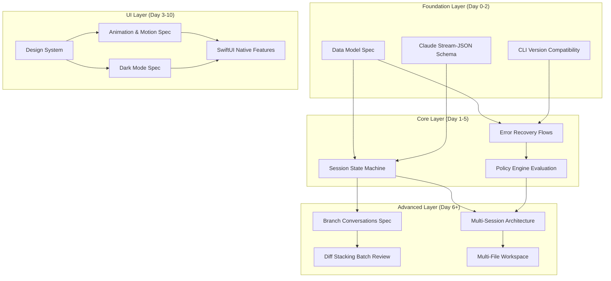
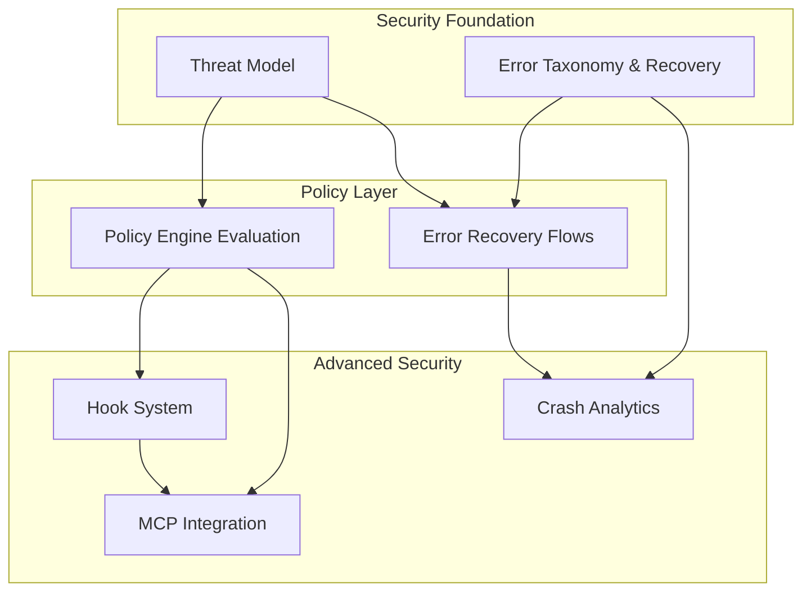
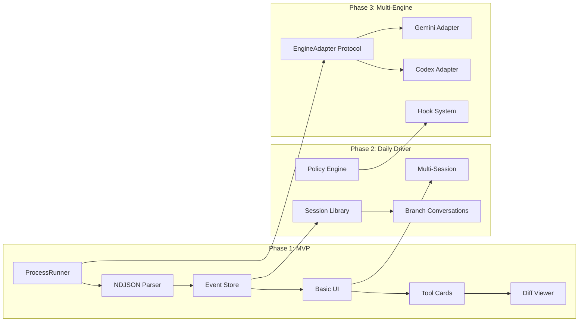
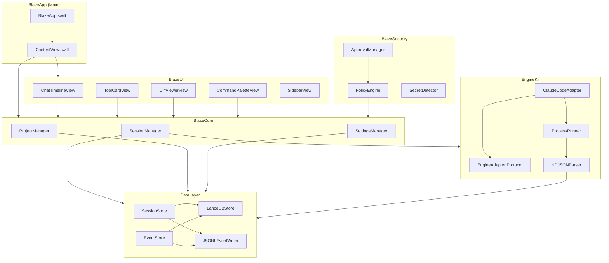
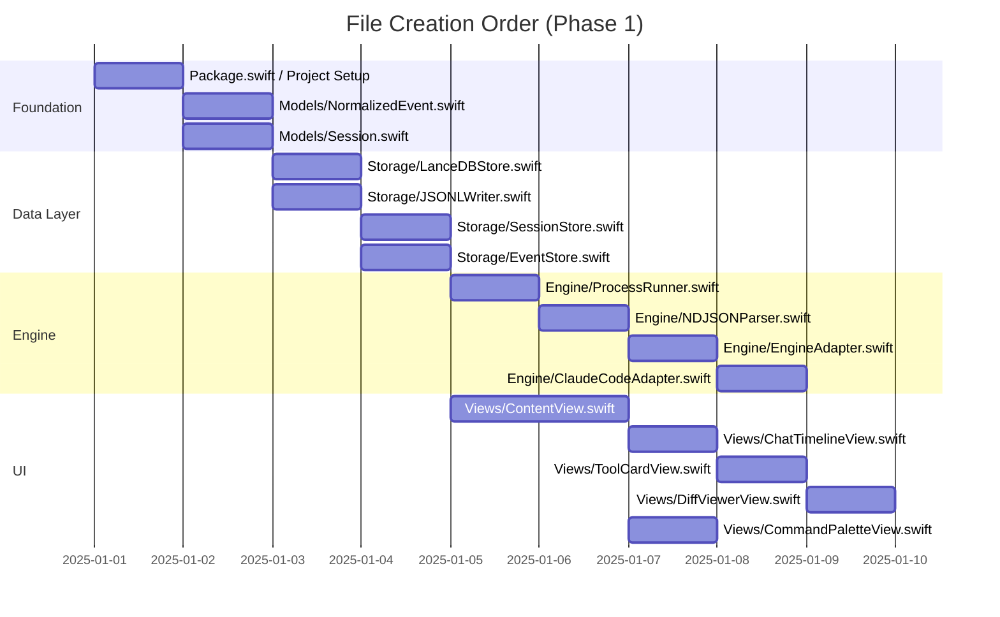
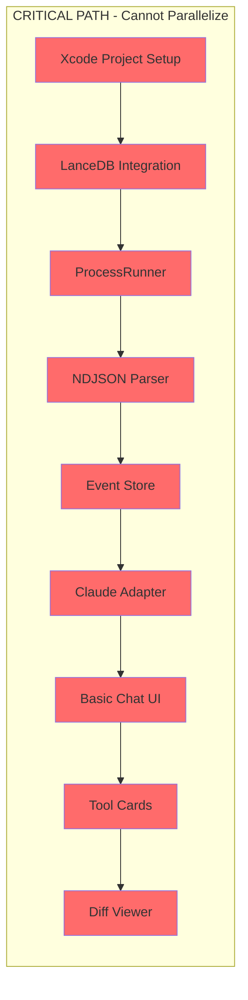
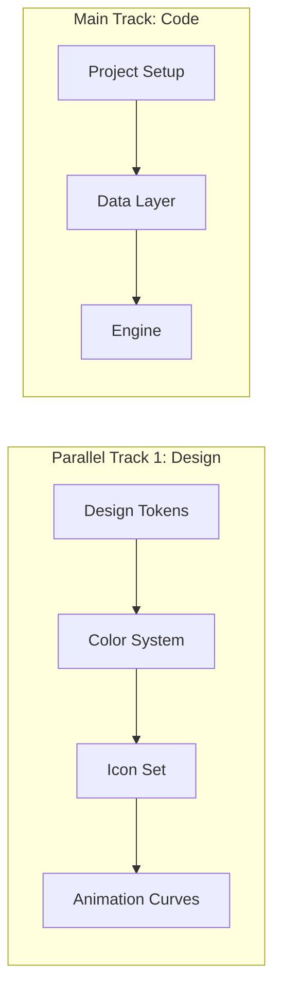

# Implementation Blueprint

> **Status:** `Draft` | **Last Updated:** 2025-12-30 | **Version:** 1.0

---

## Overview

This document provides the build execution guide for Cogit0 Blaze, including:
1. **Dependency Graph** - What depends on what
2. **Critical Path Analysis** - What blocks what, parallel opportunities
3. **Atomic Task Breakdown** - 2-4 hour implementation chunks

**Purpose:** Ensure smooth build progression with no surprises about missing dependencies.

---

## Table of Contents

1. [Spec Dependency Graph](#1-spec-dependency-graph)
2. [Component Dependency Graph](#2-component-dependency-graph)
3. [Critical Path Analysis](#3-critical-path-analysis)
4. [Phase 1 Atomic Tasks](#4-phase-1-atomic-tasks)
5. [Phase 2 Atomic Tasks](#5-phase-2-atomic-tasks)
6. [Risk Dependencies](#6-risk-dependencies)
7. [Parallel Work Opportunities](#7-parallel-work-opportunities)

---

## 1. Spec Dependency Graph

### 1.1 Core Architecture Dependencies



### 1.2 Security & Safety Dependencies



### 1.3 Feature Dependencies



---

## 2. Component Dependency Graph

### 2.1 Swift Module Dependencies



### 2.2 File Creation Order



---

## 3. Critical Path Analysis

### 3.1 Critical Path (Blocking Chain)



**Critical Path Duration:** ~8 days (must complete sequentially)

### 3.2 Blocking Dependencies

| Blocker | Blocks | Why |
|---------|--------|-----|
| LanceDB Integration | All data operations | Can't store/retrieve without DB |
| ProcessRunner | All CLI operations | Can't spawn Claude without process management |
| NDJSON Parser | Event rendering | Can't display events without parsing |
| Event Store | Session persistence | Can't save/resume without storage |
| Claude Adapter | Any Claude interaction | Can't run Claude without adapter |
| Basic Chat UI | Tool cards, diffs | Need container before components |

### 3.3 Non-Blocking (Parallelizable)

| Component | Can Start After | Can Parallel With |
|-----------|-----------------|-------------------|
| Design tokens | Day 0 | Everything |
| Animation system | Day 0 | Everything |
| Settings UI | Day 2 | Chat UI development |
| Command palette | Day 3 | Tool cards |
| Session list UI | Day 3 | Chat UI |
| Error handling UI | Day 4 | Diff viewer |
| Keyboard shortcuts | Day 5 | Testing |

---

## 4. Phase 1 Atomic Tasks

### Day 0: Project Setup (4-6 hours)

| ID | Task | Duration | Dependencies | Acceptance Criteria |
|----|------|----------|--------------|---------------------|
| D0.1 | Create Xcode project with SwiftUI lifecycle | 1h | None | Project builds, runs empty window |
| D0.2 | Configure Swift Package Manager | 1h | D0.1 | Package.swift with targets defined |
| D0.3 | Add LanceDB Swift package dependency | 1h | D0.2 | Dependency resolves, imports work |
| D0.4 | Create folder structure (Engine/, Data/, UI/, Core/) | 30m | D0.1 | Folders exist with placeholder files |
| D0.5 | Validate Claude CLI installed and working | 30m | None | `claude --version` succeeds |
| D0.6 | Create basic app icon placeholder | 30m | D0.1 | Icon shows in Dock |
| D0.7 | Setup .gitignore and initial commit | 30m | D0.1 | Clean git state |

### Day 1: Foundation (6-8 hours)

| ID | Task | Duration | Dependencies | Acceptance Criteria |
|----|------|----------|--------------|---------------------|
| D1.1 | Define `NormalizedEvent` enum with all cases | 2h | D0.4 | All event types from spec defined |
| D1.2 | Define `Session` model with core properties | 1h | D0.4 | id, name, createdAt, state, projectId |
| D1.3 | Define `ToolCall` model | 1h | D1.1 | id, name, input, output, duration, status |
| D1.4 | Define `Diff` model with unified diff support | 1h | D1.1 | filePath, hunks, stats, decision |
| D1.5 | Create `EventEnvelope` wrapper | 30m | D1.1 | id, sessionId, timestamp, sequence, event |
| D1.6 | Implement basic NavigationSplitView shell | 2h | D0.1 | Three-pane layout renders |
| D1.7 | Add placeholder views for each pane | 1h | D1.6 | Sessions, Chat, Sidebar placeholders |

### Day 2: Data Layer (6-8 hours)

| ID | Task | Duration | Dependencies | Acceptance Criteria |
|----|------|----------|--------------|---------------------|
| D2.1 | Implement `LanceDBStore` wrapper class | 3h | D0.3, D1.2 | Can open/close database |
| D2.2 | Create sessions table schema | 1h | D2.1 | Table created with correct columns |
| D2.3 | Create events table schema | 1h | D2.1 | Table created with correct columns |
| D2.4 | Implement `JSONLEventWriter` for crash recovery | 2h | D1.5 | Events append to .jsonl file |
| D2.5 | Implement `SessionStore` CRUD operations | 2h | D2.2 | Create, read, update, delete sessions |
| D2.6 | Implement `EventStore` append and query | 2h | D2.3 | Append events, query by sessionId |
| D2.7 | Write unit tests for data layer | 2h | D2.5, D2.6 | All CRUD operations tested |

### Day 3: Process Runner (4-6 hours)

| ID | Task | Duration | Dependencies | Acceptance Criteria |
|----|------|----------|--------------|---------------------|
| D3.1 | Implement `ProcessRunner` with Process spawn | 2h | D0.4 | Can spawn any executable |
| D3.2 | Add stdout/stderr pipe handling | 1h | D3.1 | Streams captured as Data |
| D3.3 | Implement async stream for output | 1h | D3.2 | AsyncStream<ProcessOutput> works |
| D3.4 | Add cancellation support (SIGINT/SIGKILL) | 1h | D3.1 | Process terminates within 2s |
| D3.5 | Add timeout support | 1h | D3.1 | Process killed after timeout |
| D3.6 | Add environment variable handling | 30m | D3.1 | Custom env vars passed to child |
| D3.7 | Write unit tests for ProcessRunner | 1h | D3.1-D3.6 | All process scenarios tested |

### Day 4: NDJSON Parser (4-6 hours)

| ID | Task | Duration | Dependencies | Acceptance Criteria |
|----|------|----------|--------------|---------------------|
| D4.1 | Implement line buffer for partial NDJSON | 1h | D3.3 | Handles split lines across chunks |
| D4.2 | Implement JSON line parser | 1h | D4.1 | Valid JSON decoded per line |
| D4.3 | Map Claude event types to NormalizedEvent | 2h | D4.2, D1.1 | All Claude events mapped |
| D4.4 | Handle malformed/unknown events gracefully | 1h | D4.3 | Logs warning, doesn't crash |
| D4.5 | Extract diffs from tool_result events | 1h | D4.3 | Diff model populated from output |
| D4.6 | Write unit tests with sample Claude output | 2h | D4.1-D4.5 | Parser handles all event types |

### Day 5: Streaming UI (6-8 hours)

| ID | Task | Duration | Dependencies | Acceptance Criteria |
|----|------|----------|--------------|---------------------|
| D5.1 | Implement `ChatTimelineView` with LazyVStack | 2h | D1.6 | Scrollable message list |
| D5.2 | Implement `MessageBubble` for user/assistant | 1h | D5.1 | Distinct styling per role |
| D5.3 | Add streaming text support with AttributedString | 2h | D5.2 | Text appends smoothly |
| D5.4 | Implement typing indicator animation | 1h | D5.3 | Dots animate during stream |
| D5.5 | Add auto-scroll to bottom during stream | 1h | D5.1 | View follows new content |
| D5.6 | Ensure 60fps during rapid updates | 1h | D5.3 | No frame drops on fast streams |
| D5.7 | Add scroll transitions (from SNF spec) | 1h | D5.1 | Messages fade at edges |

### Day 6: Tool Cards (4-6 hours)

| ID | Task | Duration | Dependencies | Acceptance Criteria |
|----|------|----------|--------------|---------------------|
| D6.1 | Implement `ToolCardCompact` view | 1h | D5.1 | Shows icon, name, duration |
| D6.2 | Implement `ToolCardExpanded` view | 2h | D6.1 | Shows full input/output |
| D6.3 | Add matched geometry transition | 1h | D6.1, D6.2 | Smooth expand/collapse |
| D6.4 | Add success/failure state styling | 30m | D6.1 | Green/red indicators |
| D6.5 | Implement copy actions (input/output) | 1h | D6.2 | Clipboard copy works |
| D6.6 | Add duration display with live counter | 1h | D6.1 | Duration updates during run |

### Day 7: Timeline Sidebar (4-6 hours)

| ID | Task | Duration | Dependencies | Acceptance Criteria |
|----|------|----------|--------------|---------------------|
| D7.1 | Implement `TimelineView` in sidebar | 2h | D1.7 | Shows event list |
| D7.2 | Add event type filtering | 1h | D7.1 | Toggle tools/diffs/errors |
| D7.3 | Add jump-to-event action | 1h | D7.1, D5.1 | Clicking scrolls chat |
| D7.4 | Implement duration histogram | 2h | D7.1 | Visual distribution of times |
| D7.5 | Add event count badges | 30m | D7.1 | Shows count per type |

### Day 8: Diff Viewer (6-8 hours)

| ID | Task | Duration | Dependencies | Acceptance Criteria |
|----|------|----------|--------------|---------------------|
| D8.1 | Implement unified diff renderer | 2h | D1.4 | +/- lines colored |
| D8.2 | Add syntax highlighting (basic) | 2h | D8.1 | Language-aware colors |
| D8.3 | Implement accept/reject buttons | 1h | D8.1 | Buttons visible per file |
| D8.4 | Wire accept to file system write | 1h | D8.3 | Changes apply to disk |
| D8.5 | Wire reject to git checkout/stash | 1h | D8.3 | File reverts to original |
| D8.6 | Add diff card in chat timeline | 1h | D8.1, D5.1 | Diffs appear inline |
| D8.7 | Handle large diffs (>2000 lines) | 1h | D8.1 | Pagination or truncation |

### Day 9: Command Palette (4-6 hours)

| ID | Task | Duration | Dependencies | Acceptance Criteria |
|----|------|----------|--------------|---------------------|
| D9.1 | Implement `CommandPaletteView` overlay | 2h | D1.6 | Modal appears on Cmd+K |
| D9.2 | Add fuzzy search algorithm | 1h | D9.1 | Matches partial strings |
| D9.3 | Define command registry | 1h | D9.1 | Commands registered with actions |
| D9.4 | Add recent commands section | 1h | D9.3 | Last 10 commands shown |
| D9.5 | Add keyboard navigation (up/down/enter) | 1h | D9.1 | Arrow keys work |
| D9.6 | Style with Raycast-inspired design | 1h | D9.1 | Matches design system |

### Day 10: Session Management (4-6 hours)

| ID | Task | Duration | Dependencies | Acceptance Criteria |
|----|------|----------|--------------|---------------------|
| D10.1 | Implement session list in left pane | 1h | D2.5 | Shows all sessions |
| D10.2 | Add new session creation flow | 1h | D10.1 | Creates and switches to new |
| D10.3 | Add session rename | 30m | D10.1 | Double-click to rename |
| D10.4 | Add session delete with confirmation | 1h | D10.1 | Deletes from DB and list |
| D10.5 | Implement session resume/continue | 2h | D10.1, D2.6 | Loads events, continues |
| D10.6 | Add session search | 1h | D10.1 | Filters by name |
| D10.7 | Persist selected session across restart | 1h | D10.1 | Last session reopens |

### Day 11-12: Testing (8-12 hours)

| ID | Task | Duration | Dependencies | Acceptance Criteria |
|----|------|----------|--------------|---------------------|
| D11.1 | Write unit tests for all models | 2h | D1.* | Models encode/decode correctly |
| D11.2 | Write integration tests for data layer | 2h | D2.* | CRUD operations work end-to-end |
| D11.3 | Write integration tests for engine | 2h | D3.*, D4.* | Claude invocation works |
| D11.4 | Manual testing: full session flow | 2h | All | Create session, send message, see response |
| D11.5 | Manual testing: tool execution | 1h | D6.* | Tool cards appear, expand, copy |
| D11.6 | Manual testing: diff workflow | 1h | D8.* | Accept/reject applies correctly |
| D11.7 | Edge case testing: network errors | 1h | D4.* | Errors display gracefully |
| D11.8 | Edge case testing: large outputs | 1h | D5.*, D8.* | No UI freeze on large data |

### Day 13: Stabilization (6-8 hours)

| ID | Task | Duration | Dependencies | Acceptance Criteria |
|----|------|----------|--------------|---------------------|
| D13.1 | Fix bugs found in testing | 4h | D11-D12 | All critical bugs fixed |
| D13.2 | Memory profiling with Instruments | 1h | All | No memory leaks |
| D13.3 | Performance profiling | 1h | All | 60fps maintained |
| D13.4 | Crash recovery testing | 1h | D2.4 | JSONL rehydration works |
| D13.5 | Add error handling UI polish | 2h | D11.7 | Errors are user-friendly |

### Day 14: Packaging (4-6 hours)

| ID | Task | Duration | Dependencies | Acceptance Criteria |
|----|------|----------|--------------|---------------------|
| D14.1 | Configure app signing | 1h | D0.1 | Developer ID certificate |
| D14.2 | Create release.sh script | 1h | D14.1 | Script builds release |
| D14.3 | Test notarization flow | 1h | D14.2 | Apple notarizes successfully |
| D14.4 | Create DMG packaging | 1h | D14.3 | DMG mounts, drag to Applications |
| D14.5 | Test on clean macOS VM | 1h | D14.4 | Gatekeeper passes |
| D14.6 | Document known issues | 1h | D11-D13 | README updated |

---

## 5. Phase 2 Atomic Tasks (Summary)

### Week 3: Sessions (Days 15-21)

| ID | Task | Duration | Dependencies |
|----|------|----------|--------------|
| W3.1 | Session library view with groups | 4h | D10.* |
| W3.2 | Session profiles (per-project settings) | 4h | W3.1 |
| W3.3 | Session fork functionality | 4h | W3.1 |
| W3.4 | Session export as .blaze bundle | 4h | W3.1 |
| W3.5 | Session import from .blaze | 2h | W3.4 |
| W3.6 | Branch conversations - data model | 4h | D2.* |
| W3.7 | Branch conversations - UI | 6h | W3.6 |

### Week 4: Workspace (Days 22-28)

| ID | Task | Duration | Dependencies |
|----|------|----------|--------------|
| W4.1 | File tree view in sidebar | 4h | D1.7 |
| W4.2 | Read-only file viewer | 4h | W4.1 |
| W4.3 | Tab bar for multiple files | 4h | W4.2 |
| W4.4 | Quick Open (Cmd+P) | 3h | W4.1 |
| W4.5 | File change indicators | 2h | W4.1, D8.* |

### Week 5: Policies (Days 29-35)

| ID | Task | Duration | Dependencies |
|----|------|----------|--------------|
| W5.1 | Policy data model | 2h | D2.* |
| W5.2 | Policy rule evaluation engine | 4h | W5.1 |
| W5.3 | PreToolUse hook integration | 4h | W5.2 |
| W5.4 | Approval modal UI | 3h | W5.3 |
| W5.5 | Approval scope selection | 2h | W5.4 |
| W5.6 | Policy editor UI | 4h | W5.1 |
| W5.7 | Built-in policy presets | 2h | W5.1 |

### Week 6: Observability (Days 36-42)

| ID | Task | Duration | Dependencies |
|----|------|----------|--------------|
| W6.1 | Timeline filter enhancements | 3h | D7.* |
| W6.2 | Session checkpoints | 4h | D2.* |
| W6.3 | Error recovery UI flows | 4h | W6.2 |
| W6.4 | Export timeline as markdown | 2h | D7.* |
| W6.5 | Token usage display | 3h | D4.* |

### Week 7: Polish (Days 43-49)

| ID | Task | Duration | Dependencies |
|----|------|----------|--------------|
| W7.1 | Performance optimization pass | 4h | All |
| W7.2 | Keyboard shortcuts implementation | 4h | D9.* |
| W7.3 | Accessibility audit (VoiceOver) | 4h | All UI |
| W7.4 | Menu bar companion app | 6h | W3.* |
| W7.5 | Drag and drop support | 4h | W3.4 |

---

## 6. Risk Dependencies

### High Risk

| Risk | Impact | Mitigation | Owner |
|------|--------|------------|-------|
| LanceDB Swift bindings immature | Blocks all data | Have SQLite fallback ready | Day 0-2 |
| Claude CLI output format changes | Breaks parser | Version detection, multiple parser versions | Day 4 |
| Process spawning sandbox issues | Blocks CLI | Test on clean Mac early | Day 3 |

### Medium Risk

| Risk | Impact | Mitigation | Owner |
|------|--------|------------|-------|
| SwiftUI performance on large lists | UI jank | LazyVStack, virtualization | Day 5 |
| Diff parsing edge cases | Incorrect diffs | Extensive test cases | Day 8 |
| Notarization rejection | Blocks distribution | Follow Apple guidelines strictly | Day 14 |

### Low Risk

| Risk | Impact | Mitigation | Owner |
|------|--------|------------|-------|
| Design system iteration | Visual rework | Start with tokens, not pixels | Day 1 |
| Command palette search quality | Poor UX | Use proven fuzzy algorithm | Day 9 |

---

## 7. Parallel Work Opportunities

### Can Start Immediately (Day 0)



### Can Start After Day 2

| Parallel Track | Main Track Progress | Team Member |
|----------------|---------------------|-------------|
| Settings UI | Data layer done | Dev B |
| Onboarding screens | Basic UI done | Dev B |
| Policy data model | Data layer done | Dev B |

### Can Start After Day 5

| Parallel Track | Main Track Progress | Team Member |
|----------------|---------------------|-------------|
| Command palette | Basic chat done | Dev B |
| Timeline sidebar | Chat rendering done | Dev B |
| Keyboard shortcuts | UI components exist | Dev B |

### Solo Developer Strategy

If working alone, prioritize critical path and defer these to Phase 2:
- Menu bar companion
- Spotlight integration
- Quick Look provider
- Branch conversations

---

## 8. Task Checklist Format

Copy this to track progress:

```markdown
## Day [N] Progress

### Completed
- [ ] Task ID: Description

### In Progress
- [ ] Task ID: Description (blocked by: X)

### Blocked
- [ ] Task ID: Description (waiting for: Y)

### Notes
- Issue found: ...
- Decision made: ...
```

---

## Document History

| Version | Date | Author | Changes |
|---------|------|--------|---------|
| 1.0 | 2025-12-30 | Claude | Initial blueprint |

---

**End of Document**
